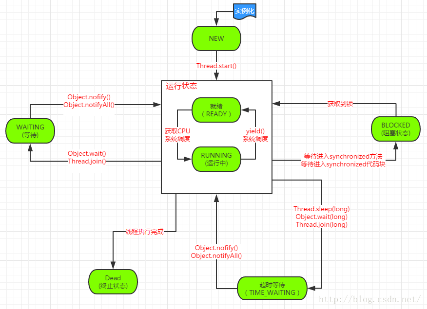

## 简述程序、进程、线程的基本概念
### 程序
- 是含有指令和数据的文件，被存储在磁盘或其他的数据存储设备中，也就是说程序是`静态的代码`
### 进程
- 是`程序的一次执行过程`，是系统运行程序的基本单位，因此进程是动态的
- 系统运行一个程序即是一个进程从创建，运行到消亡的过程
- 简单来说，一个进程就是一个执行中的程序，它在计算机中一个指令接着一个指令地执行着，同时，每个进程还占有某些系统资源如 CPU 时间，内存空间，文件，输入输出设备的使用权等等，换句话说，`当程序在执行时，将会被操作系统载入内存中`

### 线程
- 与进程相似，但线程是一个比进程更小的执行单位
- 一个进程在其执行的过程中可以产生多个线程
- 与进程不同的是同类的多个线程`共享同一块内存空间和一组系统资源`，所以系统在产生一个线程，或是在各个线程之间作切换工作时，负担要比进程小得多，也正因为如此，线程也被称为`轻量级进程`

> - 线程和进程最大的不同在于基本上`各进程是独立的`，而各线程则不一定，因为同一进程中的线程极有可能会相互影响
> - 从另一角度来说，进程属于操作系统的范畴，主要是同一段时间内，可以同时执行一个以上的程序，而线程则是在同一程序内几乎同时执行一个以上的程序段

## 并发与并行的区别
- **并发：** 同一时间段，多个任务都在执行（单核cpu通过快速切换时间片实现多任务同时执行）
- **并行：** 单位时间内，多个任务同时执行（多核cpu同时处理多个任务）

## 线程的生命周期和状态

- 线程创建之后它将处于 `NEW（新建）` 状态，调用 `start()` 方法后开始运行，线程这时候处于 `READY（可运行）` 状态
- 可运行状态的线程获得了 `CPU 时间片`（timeslice）后就处于 `RUNNING（运行）` 状态
- 当线程执行 `wait()`方法之后，线程进入 `WAITING（等待）` 状态，进入等待状态的线程需要依靠其他线程的通知才能够返回到运行状态
-  `TIME_WAITING(超时等待)` 状态相当于在等待状态的基础上增加了超时限制，比如通过 `sleep（long millis）`方法或 `wait（long millis）`方法可以将 Java 线程置于 `TIME_WAITING(超时等待)` 状态，当超时时间到达后 Java 线程将会返回到 RUNNABLE 状态
-  当线程调用`同步方法`时，在没有获取到锁的情况下，线程将会进入到 `BLOCKED（阻塞）` 状态
-  线程在执行 Runnable 的`run()`方法之后将会进入到 `TERMINATED（终止）` 状态

## 使用多线程可能带来的问题

### 上下文切换
- 当前任务在执行完 CPU 时间片切换到另一个任务之前会先保存自己的状态，以便下次再切换回这个任务时，可以再加载这个任务的状态，`任务从保存到再加载的过程就是一次上下文切换`
- 上下文切换通常是计算密集型的。也就是说，它需要相当可观的处理器时间，在每秒几十上百次的切换中，每次切换都需要纳秒量级的时间。所以，`上下文切换对系统来说意味着消耗大量的 CPU 时间`，事实上，可能是操作系统中时间消耗最大的操作
> Linux 相比与其他操作系统（包括其他类 Unix 系统）有很多的优点，其中有一项就是，其上下文切换和模式切换的时间消耗非常少

### 线程死锁
#### 认识线程死锁

- 多个线程同时被阻塞，它们中的一个或者全部都在等待某个资源被释放。由于线程被无限期地阻塞，因此程序不可能正常终止
- 产生死锁的四个条件：
> 1. 互斥条件：该资源任意一个时刻只由一个线程占用
> 2. 请求与保持条件：一个进程因请求资源而阻塞时，对已获得的资源保持不放
> 3. 不剥夺条件:线程已获得的资源在末使用完之前不能被其他线程强行剥夺，只有自己使用完毕后才释放资源
> 4. 循环等待条件:若干进程之间形成一种头尾相接的循环等待资源关系

####  如何避免线程死锁
- **破坏互斥条件** ：这个条件我们没有办法破坏，因为我们用锁本来就是想让他们互斥的（临界资源需要互斥访问）
- **破坏请求与保持条件** ：一次性申请所有的资源
**破坏不剥夺条件** ：占用部分资源的线程进一步申请其他资源时，如果申请不到，可以主动释放它占有的资源
**破坏循环等待条件** ：靠按序申请资源来预防。按某一顺序申请资源，释放资源则反序释放。破坏循环等待条件

## 为什么我们调用 start() 方法时会执行 run() 方法，为什么我们不能直接调用 run() 方法
- new 一个 Thread，线程进入了新建状态;调用 start() 方法，会启动一个线程并使线程进入了就绪状态，当分配到时间片后就可以开始运行了。 start() 会执行线程的相应准备工作，然后自动执行 run() 方法的内容，这是真正的多线程工作。 而直接执行 run() 方法，会把 run 方法当成一个 main 线程下的普通方法去执行，并不会在某个线程中执行它，所以这并不是多线程工作
- **总结： 调用 start 方法方可启动线程并使线程进入就绪状态，而 run 方法只是 thread 的一个普通方法调用，还是在主线程里执行。**

## 线程操作
### Thread.sleep(long)
- 使当前线程进入`TIME_WAITING`状态
- 让位给`任意优先级`的线程
- `不释放锁`

### Thread.yield()
- 让线程进入`READY`状态
* 让位给`同等或更高优先级`的线程
* `不释放锁`

### Object.wait()和Object.wait(long)
- 使线程进入`WAITING`/`TIME_WAITING`状态
- 让位给`任意优先级`的线程
- `释放锁` 
- 需要配合`synchronized`使用
- 需要`持有锁`的线程才能调用

### Object.notify()和Object.notifyAll()
- 从对象等待池中（`WAITING`/`TIME_WAITING`）唤醒一个/所有等待线程
- 需要配合`synchronized`使用
- 需要`持有锁`的线程才能调用

### Thread.Join()
- 把指定的线程加入到当前线程，可以将两个交替执行的线程合并为顺序执行的线程。比如在线程B中调用了线程A的Join()方法，直到线程A执行完毕后，才会继续执行线程B。

### 停止线程

#### stop（已废弃）
- 直接停止线程，不管运行状态，可能会出现不完整的数据

#### 使用flag

#### interrupt（原理同使用flag）
- void interrupt()
> 向线程发送中断请求，线程的中断状态将会被设置为true，如果当前线程被一个sleep调用阻塞，那么将会抛出interrupedException异常

- static boolean interrupted()
> 测试当前线程（当前正在执行命令的这个线程）是否被中断。注意这是个静态方法，调用这个方法会产生一个副作用那就是它会将当前线程的中断状态重置为false

- boolean isInterrupted()
> 判断线程是否被中断，这个方法的调用不会产生副作用即不改变线程的当前中断状态

- static Thread currentThread() 
> 返回代表当前执行线程的Thread对象

## 线程调度策略
### 抢占式调度
- 每条线程执行的时间、线程的切换都由系统控制，系统控制指的是在系统某种运行机制下，可能每条线程都分同样的执行时间片，也可能是某些线程执行的时间片较长，甚至某些线程得不到执行的时间片
- 在这种机制下，`一个线程的堵塞不会导致整个进程堵塞`

### 协同式调度
- 某一线程执行完后主动通知系统切换到另一线程上执行，这种模式就像接力赛一样，一个人跑完自己的路程就把接力棒交接给下一个人，下个人继续往下跑
- 线程的执行时间由线程本身控制，线程切换可以预知，不存在多线程同步问题，但它有一个致命弱点：`如果一个线程编写有问题，运行到一半就一直堵塞，那么可能导致整个系统崩溃`

## JVM的线程调度策略
- JVM规范中规定每个线程都有`优先级`，且优先级越高越优先执行，但优先级高并不代表能独自占用执行时间片，可能是优先级高得到越多的执行时间片，反之，优先级低的分到的执行时间少但不会分配不到执行时间。
- java使用的线程调度式`抢占式调度`

### 线程让出cpu的情况：
- 当前运行线程主动放弃CPU，JVM暂时放弃CPU操作（基于时间片轮转调度的JVM操作系统不会让线程永久放弃CPU，或者说放弃本次时间片的执行权），例如调用yield()方法。
- 当前运行线程因为某些原因进入阻塞状态，例如阻塞在I/O上
- 当前运行线程结束，即运行完run()方法里面的任务

