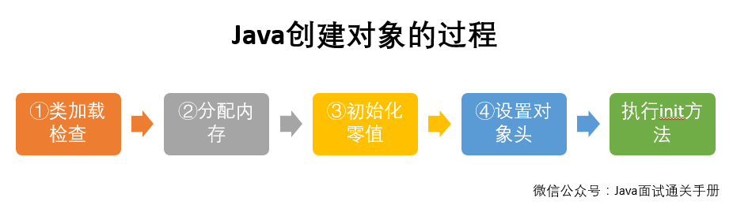
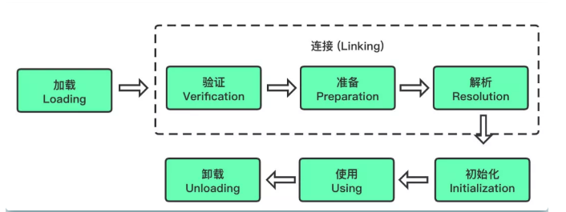
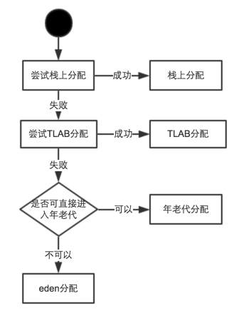
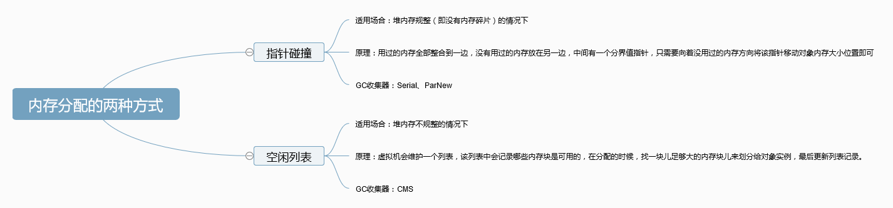
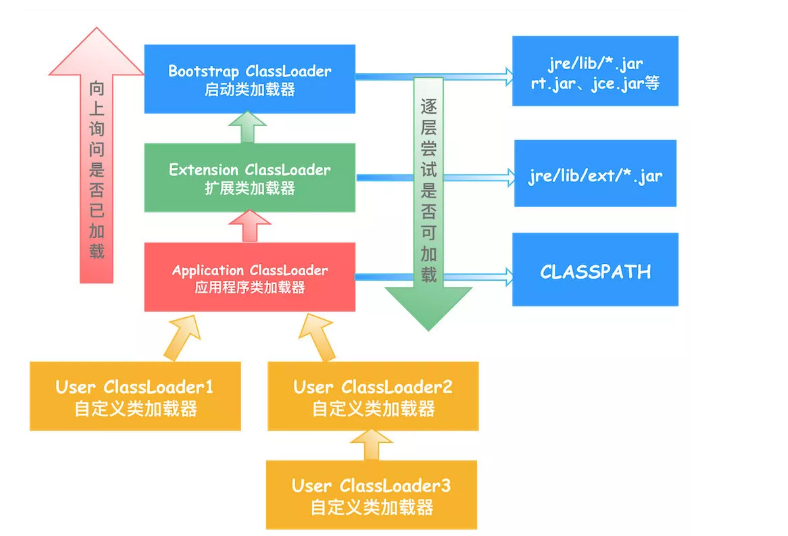
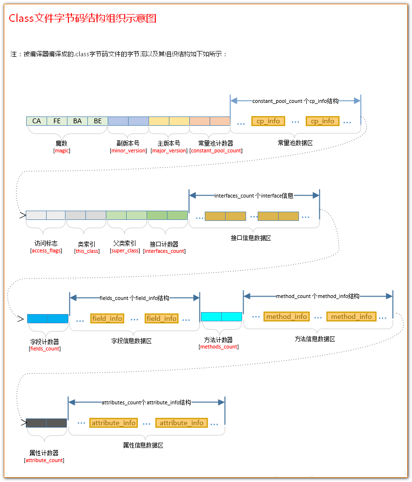

## 对象的创建过程


### 类加载


#### 加载
##### 过程
- 类加载器根据一个类的全限定名来获取此类的二进制字节流
- 将这个字节流所代表的的静态存储结构转化为方法区的运行时数据结构
- 在内存中生成一个代表这个类的 java.lang.Class 对象，作为方法区这个类的各种数据的访问入口
- 加载 .calss 文件的方式


    1. 从本地系统中直接加载
    2. 通过网络获取，典型场景：Web Applet
    3. 从zip压缩文件中读取，成为日后jar、war格式的基础
    4. 运行时计算生成，使用最多的是：动态代理技术
    5. 由其他文件生成，比如 JSP 应用
    6. 从专有数据库提取.class 文件，比较少见
    7. 从加密文件中获取，典型的防Class文件被反编译的保护措施

#### 连接
##### 验证
- 目的在于确保Class文件的字节流中包含信息符合当前虚拟机要求，保证被加载类的正确性，不会危害虚拟机自身安全
- 如果所引用的类经过反复验证，那么可以考虑采用-Xverifynone参数来关闭大部分的类验证措施，以缩短虚拟机类加载的时间
- **文件格式验证：** 验证字节流是否符合Class文件格式的规范，若符合，字节流才会进入方法区
- **元数据验证：** 验证字节码描述的信息是否符合Java语言规范
- **字节码验证：** 验证程序语义是否合法，合逻辑
- **符号引用验证：** 将符号引用转化为直接引用的时候，确保解析动作的正常执行

##### 准备
- 为static变量分配内存并且设置该类变量的默认初始值，即零值
- 被final修饰的static变量在编译的时候就会分配内存，准备阶段会直接赋值

##### 解析
- 将常量池内的符号引用转换为直接引用的过程
- 事实上，解析操作往往会伴随着JVM在执行完初始化之后再执行
- 符号引用就是一组符号来描述所引用的目标。符号引用的字面量形式明确定义在《Java虚拟机规范》的Class文件格式中
- 直接引用就是直接指向目标的指针、相对偏移量或一个间接定位到目标的句柄
- 解析动作主要针对类或接口、字段、类方法、接口方法、方法类型等。对应常量池中的CONSTANT_Class_info、CONSTANT_Fieldref_info、CONSTANT_Methodref_info等

#### 初始化
##### 执行类构造器 `<clinit>()`
- `<clinit>()`是由编译器自动收集类中的所有静态变量的赋值动作和静态方法块中的语句合并而成
- 虚拟机会保证子类执行`<clinit>()`方法之前，其父类已经执行了`<clinit>()`方法（如果该类是接口，则不会为其父类执行`<clinit>()`方法）
- 如果类中没有静态变量的赋值操作和静态方法快，就不会生成`<clinit>()`
- `<clinit>()`方法执行的时候会加锁
- 同一个类加载器下，一个类只会初始化一次

##### 初始化顺序
- 父类静态变量，静态代码块
- 子类静态变量，静态代码块
- 父类非静态变量，非静态代码块，构造函数
- 子类非静态变量，非静态代码块，构造函数

##### 触发初始化的情况

- 遇到`new,getstatic,putstatic,invokestatic`这四调字节码指令时，场景如下:


    使用new关键字实例化对象的时候
    读取或设置一个类的静态字段（被final修饰除外）的时候
    调用一个类的静态方法的时候

- 反射
- 子类被初始化
- 当虚拟机启动时，用户需要指定一个要执行的主类（包含main()方法的那个类），虚拟机会先初始化这个主类
- 当使用jdk1.7动态语言支持时，如果一个java.lang.invoke.MethodHandle实例最后的解析结果REF_getstatic,REF_putstatic,REF_invokeStatic的方法句柄，并且这个方法句柄所对应的类没有进行初始化，则需要先出触发其初始化
### 分配内存

#### 栈上分配
- 通过Java虚拟机提供的`逃逸分析`实现
- 栈上分配速度快，提高系统性能
- 可以在函数调用结束后自行销毁对象，不需要垃圾回收器的介入，有效避免垃圾回收带来的负面影响
- 栈空间小，对于大对象无法实现栈上分配
##### 逃逸分析的作用
- 堆分配对象变成`栈分配`对象


    一个方法当中的对象，对象的引用没有发生逃逸，那么这个方法可能会被分配在栈内存上而非常见的堆内存上

- 消除同步（`锁消除`）


	线程同步的代价是相当高的，同步的后果是降低并发性和性能。逃逸分析可以判断出某个对象是否始终只被一个线程访问，如果只被一个线程访问，那么对该对象的同步操作就可以转化成没有同步保护的操作，这样就能大大提高并发程度和性能

- `矢量替代`


	逃逸分析方法如果发现对象的内存存储结构不需要连续进行的话，就可以将对象的部分甚至全部都保存在CPU寄存器内，这样能大大提高访问速度

##### 参数配置

- -server

> 使用server模式，只有在server模式下，才可以禁用逃逸分析

- -XX:+DoEscapeAnalysis

> 启用逃逸分析，默认启用

- -XX:-DoEscapeAnalysis

> 关闭逃逸分析

- -XX:+EliminateAllocations

> 启用标量替换，允许对象打散分配到栈上，默认启用

- -XX:-EliminateAllocations

> 关闭标量替换	 

#### TLAB分配
- TLAB，全称Thread Local Allocation Buffer, 即：线程本地分配缓存
- 这是一块线程专用的内存分配区域
- TLAB占用的是`eden区`的空间
- 在TLAB启用的情况下（默认开启），JVM会为每一个线程分配一块TLAB区域

##### 为什么需要TLAB
- 保证对象分配的`线程安全`，`加快`对象的分配`速度`
- 在线程初始化时，虚拟机会为每个线程分配一块TLAB空间，只给当前线程使用，当需要分配内存时，就在自己的空间上分配，这样就不存在竞争的情况，可以大大提升分配效率

##### refill_waste


    一个100KB的TLAB区域，如果已经使用了80KB，当需要分配一个30KB的对象时，TLAB是如何分配的呢？
    此时，虚拟机有两种选择：第一，废弃当前的TLAB（会浪费20KB的空3.4 间）；第二，将这个30KB的对象直接分配到堆上，保留当前TLAB（当有小于20KB的对象请求TLAB分配时可以直接使用该TLAB区域）
    JVM选择的策略是：在虚拟机内部维护一个叫refill_waste的值，当请求对象大于refill_waste时，会选择在堆中分配，反之，则会废弃当前TLAB，新建TLAB来分配新对象。
    【默认情况下，TLAB和refill_waste都是会在运行时不断调整的，使系统的运行状态达到最优。】


##### 参数配置

- -XX:+/-UseTLAB

> 是否开启TLAB分配

- -XX:TLABWasteTargetPercent

> 设置TLAB空间所占用Eden空间的百分比大小（TLAB默认是eden区的1%）

- -XX:-ResizeTLAB和-XX：TLABSize

> 默认情况下，TLAB的空间会在运行时不断调整，使系统达到最佳的运行状态。如果需要禁用自动调整TLAB的大小，可以使用-XX:-ResizeTLAB来禁用，并且使用-XX：TLABSize来手工指定TLAB的大小

- -XX：TLABRefillWasteFraction

> TLAB的refill_waste也是可以调整的，默认值为64，即表示使用约为1/64空间大小作为refill_waste，使用参数：-XX：TLABRefillWasteFraction来调整

- -XX+PringTLAB

> 如果想要观察TLAB的使用情况，可以使用参数-XX+PringTLAB 进行跟踪


#### 堆上分配
##### 新生代的分配
- 对象一般分配在Eden区，`当Eden区满时，会触发Minor GC`
- Minor GC后，Eden区全部对象被清理，释放空间，然后将`存活的对象复制到From区`
- 当下次Minor GC发生时，会清理Eden区和From区的空间，`将存活的对象复制到To区`
- 若再触发Minor GC，则重复上一步，只不过每次Minor GC的时候，`From和To的角色会互换`


    Eden -> From
    Eden + From -> To
    Eden + To -> From
    Eden + From -> To
    ...

##### 对象何时晋升老年代
- 年龄值（MaxTenuringThreshold，默认15）


    - 虚拟机给每个对象定义了一个对象年龄(Age)计数器
    - 对象每经历一次Minor GC，年龄就增加1,当它的年龄增加到一定程度(默认为15),就将会被晋升到老年代中

- 大对象直接进入老年代（PretenureSizeThreshold）


	可以避免在Eden区及两个Survivor区之间发生大量的内存复制

- 动态年龄


    在From（或To）区相同年龄的对象大小之和大于 From（或To）空间一半以上时，则年龄大于等于该年龄的对象也会晋升到老年代

##### 空间分配担保
- 在发生 MinorGC 之前，虚拟机会先检查老年代`最大可用的连续空间`是否大于新生代所有对象的`总空间`
- 如果大于，那么Minor GC 可以确保是安全的
- 如果不大于，那么虚拟机会查看 HandlePromotionFailure 设置值是否开启担保失败
- 如果开启担保失败，那么会继续检查老年代`最大可用连续空间`是否大于历次晋升到老年代对象的`平均大小`
- 如果大于则进行Minor GC，否则先进行一次Old GC

##### Stop The World
- 即在 GC（minor GC 或 Full GC）期间，只有垃圾回收器线程在工作，其他工作线程则被挂起

##### Safe Point
- GC发起的时间点
- 循环的末尾
- 方法返回前
- 调用方法的 call 之后
- 抛出异常的位置 

#### 内存分配的两种方式

- **指针碰撞：** 用于`堆内存规整`的垃圾收集算法（复制，标记-清除）
- **空闲列表：** 用于`堆内存不规整`的垃圾收集算法（标记-压缩）

### 初始化零值
- 内存分配完成后，虚拟机需要将分配到的内存空间都初始化为零值（不包括对象头），这一步操作保证了对象的实例字段在 Java 代码中可以不赋初始值就直接使用，程序能访问到这些字段的数据类型所对应的零值

### 设置对象头
- **虚拟机要对对象进行必要的设置**，例如这个对象是那个类的实例、如何才能找到类的元数据信息、对象的哈希吗、对象的 GC 分代年龄等信息
- **这些信息存放在对象头中。** 另外，根据虚拟机当前运行状态的不同，如是否启用偏向锁等，对象头会有不同的设置方式

### 执行 init 方法
- 在上面工作都完成之后，从虚拟机的视角来看，一个新的对象已经产生了，但从 Java 程序的视角来看，对象创建才刚开始，`<init>` 方法还没有执行，所有的字段都还为零。所以一般来说，执行 new 指令之后会接着执行 `<init>` 方法，把对象按照程序员的意愿进行初始化，这样一个真正可用的对象才算完全产生出来

## 类加载器

- JVM支持两种类型的类加载器，分别为`引导类加载器`（Bootstrap ClassLoader）和`自定义类加载器`（User-Defined ClassLoader）
- 所有派生于抽象类`ClassLoader`的类加载器都划分为自定义类加载器

### 启动类加载器（引导类加载器，Bootstrap ClassLoader）
- 这个类加载使用C/C++ 语言实现，嵌套在JVM 内部
- - 并不继承自 java.lang.ClassLoader，`没有父加载器`
- 它用来加载Java的核心库（JAVA_HOME/jre/lib/rt.jar、resource.jar或sun.boot.class.path路径下的内容），用于提供JVM自身需要的类
- 出于安全考虑，Boostrap 启动类加载器只加载名为java、Javax、sun等开头的类

### 扩展类加载器（Extension ClassLoader）
- java语言编写，由sun.misc.Launcher$ExtClassLoader实现
- 父类加载器为`启动类加载器`
- 从java.ext.dirs系统属性所指定的目录中加载类库，或从JDK的安装目录的jre/lib/ext 子目录（扩展目录）下加载类库。如果用户创建的JAR 放在此目录下，也会自动由扩展类加载器加载

### 应用程序类加载器（也叫系统类加载器，AppClassLoader）
- java语言编写，由 sun.misc.Lanucher$AppClassLoader 实现
- 父类加载器为`扩展类加载器`
- 它负责加载环境变量classpath或系统属性java.class.path 指定路径下的类库
- 该类加载是程序中默认的类加载器，一般来说，Java应用的类都是由它来完成加载的
- 通过 ClassLoader#getSystemClassLoader() 方法可以获取到该类加载器

### 用户自定义类加载器
- 通过`继承抽象类 java.lang.ClassLoader 类`的方式，实现自己的类加载器，以满足一些特殊的需求
- 把自定义的类加载逻辑写在`findClass()`方法中
- 编写自定义类加载器时，如果没有太过于复杂的需求，可以直接继承URLClassLoader类，这样就可以避免自己去编写findClass()方法及其获取字节码流的方式，使自定义类加载器编写更加简洁

### 双亲委派机制
#### 过程
- 委托


    加载类的请求由App加载器委托给Extension加载器，并由Extension加载器委托给Bootstrap加载器
    若Bootstrap加载器没有找到包，则会把加载请求返回给Extension加载器，一直到某个加载器找到包并加载为止

- 可见性


	子类加载器可以看见父类加载的类，反之不行

- 单一性


	父类加载器加载过的类，不能让子类再加载

#### 优点

- `避免类的重复加载`，JVM中区分不同类，不仅仅是根据类名，相同的class文件被不同的ClassLoader加载就属于两个不同的类（比如，Java中的Object类，无论哪一个类加载器要加载这个类，最终都是委派给处于模型最顶端的启动类加载器进行加载，如果不采用双亲委派模型，由各个类加载器自己去加载的话，系统中会存在多种不同的Object类）
- 保护程序安全，`防止核心API被随意篡改`，避免用户自己编写的类动态替换 

#### 在JVM中表示两个class对象是否为同一个类存在两个必要条件
1. 类的完全类名必须一致，包括包名
2. 加载这个类的ClassLoader（指ClassLoader实例对象）必须相同

#### 如何破坏双亲委派模型
- 双亲委派模型并不是一个强制性的约束模型，而是Java设计者推荐给开发者的类加载器实现方式，可以“被破坏”，只要我们自定义类加载器，`重写loadClass()方法`，指定新的加载逻辑就破坏了，重写findClass()方法不会破坏双亲委派

#### 为什么要破坏双亲委派模型
- 双亲委派模型有一个问题：顶层ClassLoader，无法加载底层ClassLoader的类。典型例子JNDI、JDBC，所以加入了线程上下文类加载器（Thread Context ClassLoader）,可以通过Thread.setContextClassLoaser()设置该类加载器，然后顶层ClassLoader再使用Thread.getContextClassLoader()获得底层的ClassLoader进行加载
- Tomcat中使用了自定ClassLoader，并且也破坏了双亲委托机制。每个应用使用WebAppClassloader进行单独加载，他首先使用WebAppClassloader进行类加载，如果加载不了再委托父加载器去加载，这样可以保证每个应用中的类不冲突。每个tomcat中可以部署多个项目，每个项目中存在很多相同的class文件（很多相同的jar包），他们加载到jvm中可以做到互不干扰
- 利用破坏双亲委派来实现代码热替换（每次修改类文件，不需要重启服务）。因为一个Class只能被一个ClassLoader加载一次，否则会报java.lang.LinkageError。当我们想要实现代码热部署时，可以每次都new一个自定义的ClassLoader来加载新的Class文件。JSP的实现动态修改就是使用此特性实现

#### ClassNotFoundException 和 NoClassDefFoundError 区别
- ClassNotFoundException(显式加载失败)


    - 从java.lang.Exception继承，是一个Exception类型
    - 当动态加载Class的时候找不到类会抛出该异常
    - 一般在执行Class.forName()、ClassLoader.loadClass()或ClassLoader.findSystemClass()的时候抛出

- NoClassDefFoundError（隐式加载失败）


    - 从java.lang.Error继承，是一个Error类型
    - 当编译成功以后执行过程中Class找不到导致抛出该错误
    - 由JVM的运行时系统抛出

## 类文件

### 结构
- 根据 Java 虚拟机规范，类文件由单个 ClassFile 结构组成：

```java
ClassFile {
    u4             magic; //Class 文件的标志
    u2             minor_version;//Class 的小版本号
    u2             major_version;//Class 的大版本号
    u2             constant_pool_count;//常量池的数量
    cp_info        constant_pool[constant_pool_count-1];//常量池
    u2             access_flags;//Class 的访问标记
    u2             this_class;//当前类
    u2             super_class;//父类
    u2             interfaces_count;//接口
    u2             interfaces[interfaces_count];//一个类可以实现多个接口
    u2             fields_count;//Class 文件的字段属性
    field_info     fields[fields_count];//一个类会可以有个字段
    u2             methods_count;//Class 文件的方法数量
    method_info    methods[methods_count];//一个类可以有个多个方法
    u2             attributes_count;//此类的属性表中的属性数
    attribute_info attributes[attributes_count];//属性表集合
}
```

- **Class文件字节码结构组织示意图：**



下面会按照上图结构按顺序详细介绍一下 Class 文件结构涉及到的一些组件。

1.  **魔数:**  确定这个文件是否为一个能被虚拟机接收的 Class 文件。 
2. **Class 文件版本** ：Class 文件的版本号，保证编译正常执行。
3. **常量池** ：常量池主要存放两大常量：字面量和符号引用。
4. **访问标志** ：标志用于识别一些类或者接口层次的访问信息，包括：这个 Class 是类还是接口，是否为 public 或者 abstract 类型，如果是类的话是否声明为 final 等等。
5. **当前类索引,父类索引** ：类索引用于确定这个类的全限定名，父类索引用于确定这个类的父类的全限定名，由于 Java 语言的单继承，所以父类索引只有一个，除了 `java.lang.Object` 之外，所有的 java 类都有父类，因此除了 `java.lang.Object` 外，所有 Java 类的父类索引都不为 0。
6.  **接口索引集合** ：接口索引集合用来描述这个类实现了那些接口，这些被实现的接口将按`implents`(如果这个类本身是接口的话则是`extends`) 后的接口顺序从左到右排列在接口索引集合中。
7. **字段表集合**  ：描述接口或类中声明的变量。字段包括类级变量以及实例变量，但不包括在方法内部声明的局部变量。
8. **方法表集合** ：类中的方法。
9. **属性表集合** ： 在 Class 文件，字段表，方法表中都可以携带自己的属性表集合。