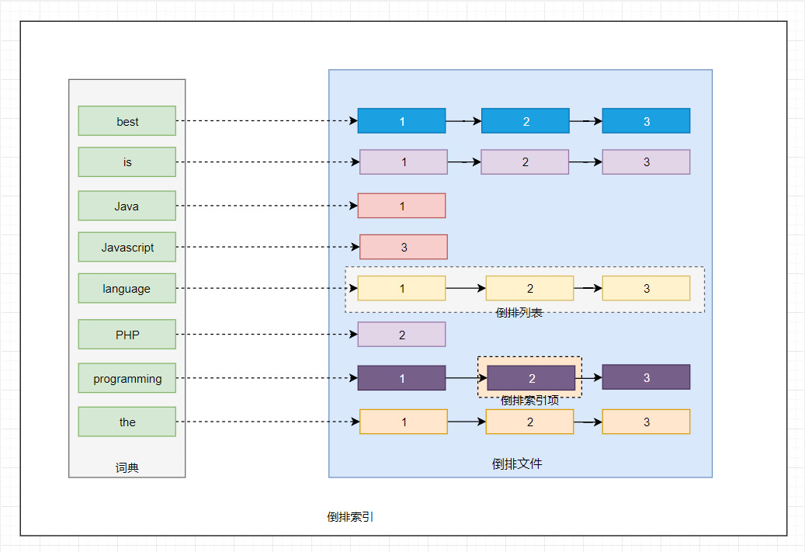
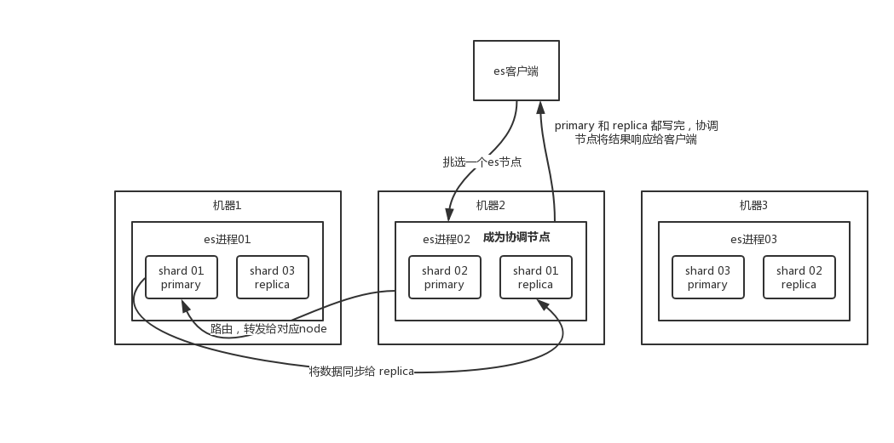
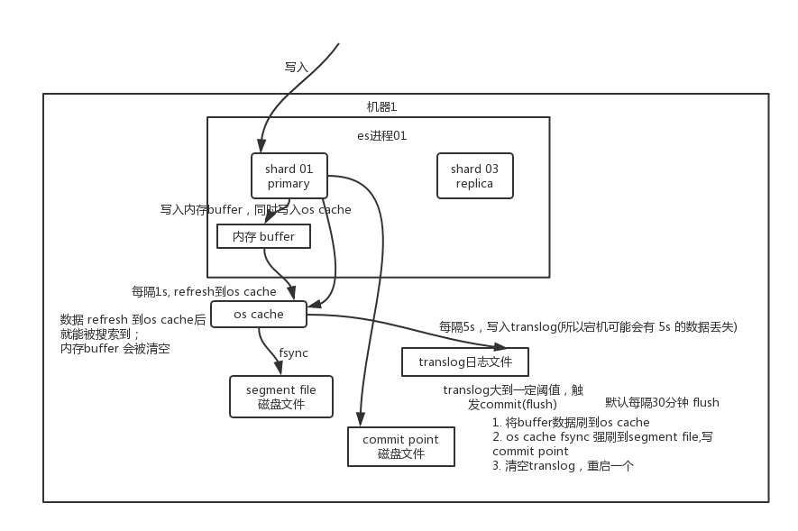

## 倒排索引

### 原理

- 为了创建倒排索引，我们通过`分词器`将每个文档的内容域拆分成单独的词（我们称它为词条或 Term），创建一个包含所有`不重复词条的排序列表`，然后`列出每个词条出现在哪个文档`
- 这种结构由文档中所有不重复词的列表构成，对于其中每个词都有一个文档列表与之关联
- 这种由属性值来确定记录的位置的结构就是倒排索引，带有倒排索引的文件我们称为倒排文件。

### 核心术语
- 词条（Term）：`索引里面最小的存储和查询单元`，对于英文来说是一个单词，对于中文来说一般指分词后的一个词
- 词典（Term Dictionary）：
    - 是`词条 Term 的集合`
    - 搜索引擎的通常索引单位是单词，单词词典是由文档集合中出现过的所有单词构成的字符串集合，单词词典内每条索引项记载单词本身的一些信息以及指向“倒排列表”的指针
- 倒排列表（Post list）：
    - 一个文档通常由多个词组成，倒排表记录的是`某个词在哪些文档里出现过以及出现的位置`
    - 每条记录称为一个倒排项（Posting）
    - 倒排表记录的不单是文档编号，还`存储了词频等信息`
- 倒排文件（Inverted File）：所有单词的倒排列表往往顺序地存储在磁盘的某个文件里，这个文件被称之为倒排文件，`倒排文件是存储倒排索引的物理文件`
- 词典和倒排表是 Lucene 中很重要的两种数据结构，是实现快速检索的重要基石
- 词典和倒排文件是分两部分存储的，`词典在内存`中而`倒排文件存储在磁盘`上

## ES核心概念

### 集群
- ES 的集群搭建很简单，不需要依赖第三方协调管理组件，自身内部就实现了集群的管理功能
- ES 集群由一个或多个 Elasticsearch 节点组成，`每个节点配置相同的 cluster.name 即可加入集群`，默认值为 “elasticsearch”
- `确保不同的环境中使用不同的集群名称`，否则最终会导致节点加入错误的集群
- 一个 Elasticsearch 服务启动实例就是一个节点（Node），节点通过 `node.name` 来设置节点名称，如果不设置则在启动时给节点分配一个随机通用唯一标识符作为名称。

#### 节点的角色
- 每个节点既可以是候选主节点也可以是数据节点，通过在配置文件 ../config/elasticsearch.yml 中设置即可，默认都为 true
```
node.master: true  //是否候选主节点
node.data: true    //是否数据节点
```
- **数据节点**
	- `负责数据的存储和相关的操作`，例如对数据进行增、删、改、查和聚合等操作，所以数据节点（Data 节点）对机器配置要求比较高，`对 CPU、内存和 I/O 的消耗很大`
	- 通常随着集群的扩大，需要增加更多的数据节点来提高性能和可用性
- **候选主节点**
	- `可以被选举为主节点`（Master 节点），集群中只有候选主节点才有选举权和被选举权，其他节点不参与选举的工作
- **主节点**
	- 负责创建索引、删除索引、跟踪哪些节点是群集的一部分，并决定哪些分片分配给相关的节点、追踪集群中节点的状态等，稳定的主节点对`集群的健康`是非常重要的
	- 主节点和其他节点之间通过 Ping 的方式互检查，主节点负责 Ping 所有其他节点，判断是否有节点已经挂掉，其他节点也通过 Ping 的方式判断主节点是否处于可用状态
- **协调节点**
    - `负责分发用户的请求、收集结果等操作`，而不需要主节点转发
    - 不需要指定和配置的，集群中的`任何节点`都可以充当协调节点的角色
- 一个节点既可以是候选主节点也可以是数据节点，但是由于数据节点对 CPU、内存核 I/O 消耗都很大，所以如果某个节点既是数据节点又是主节点，那么可能会对主节点产生影响从而对整个集群的状态产生影响
- 因此为了提高集群的健康性，我们应该对 Elasticsearch 集群中的节点做好角色上的划分和隔离
	- 可以使用几个配置较低的机器群作为候选主节点群

#### 发现机制
- Zen Discovery 是 Elasticsearch 的内置默认发现模块（发现模块的职责是发现集群中的节点以及选举 Master 节点）
- 它提供单播和基于文件的发现，并且可以扩展为通过插件支持云环境和其他形式的发现
- Zen Discovery 与其他模块集成，例如，节点之间的所有通信都使用 Transport 模块完成。节点使用发现机制通过 Ping 的方式查找其他节点
- Elasticsearch 默认被配置为使用单播发现，以防止节点无意中加入集群，`只有在同一台机器上运行的节点才会自动组成集群`
- 如果集群的节点运行在不同的机器上，使用单播，你可以为 Elasticsearch 提供一些它应该去尝试连接的节点列表
- 当一个节点联系到单播列表中的成员时，它就会得到整个集群所有节点的状态，然后它会联系 Master 节点，并加入集群
- 这意味着单播列表不需要包含集群中的所有节点， 它只是需要足够的节点，当一个新节点联系上其中一个并且说上话就可以了
- 如果你使用 Master 候选节点作为单播列表，你只要列出三个就可以了。这个配置在 elasticsearch.yml 文件中：
```
discovery.zen.ping.unicast.hosts: ["host1", "host2:port"]
```
- 节点启动后先 Ping ，如果 discovery.zen.ping.unicast.hosts 有设置，则 Ping 设置中的 Host ，否则尝试 ping localhost 的几个端口。
- Elasticsearch 支持同一个主机启动多个节点，Ping 的 Response 会包含该节点的基本信息以及该节点认为的 Master 节点

#### 选举Master
- 选举开始，先从各节点认为的 Master 中选，规则很简单，`按照 ID 的字典序排序，取第一个`，如果各节点都没有认为的 Master ，则从所有节点中选择，规则同上
- 这里有个限制条件就是 `discovery.zen.minimum_master_nodes` ，如果节点数达不到最小值的限制，则循环上述过程，直到节点数足够可以开始选举
- 最后选举结果是肯定能选举出一个 Master ，如果只有一个 Local 节点那就选出的是自己
- 如果当前节点是 Master ，则开始等待节点数达到 discovery.zen.minimum_master_nodes，然后提供服务
- 如果当前节点不是 Master ，则尝试加入 Master 
- Elasticsearch 将以上服务发现以及选主的流程叫做 `Zen Discovery` 

#### 脑裂现象
- 同时如果由于网络或其他原因导致集群中选举出多个 Master 节点，使得数据更新时出现不一致，这种现象称之为脑裂，即集群中不同的节点对于 Master 的选择出现了分歧，出现了多个 Master 竞争

##### “脑裂”问题可能有以下几个原因造成：
- **网络问题：** 集群间的网络延迟导致一些节点访问不到 Master，认为 Master 挂掉了从而选举出新的 Master，并对 Master 上的分片和副本标红，分配新的主分片
- **节点负载：** 主节点的角色既为 Master 又为 Data，访问量较大时可能会导致 ES 停止响应（假死状态）造成大面积延迟，此时其他节点得不到主节点的响应认为主节点挂掉了，会重新选取主节点
- **内存回收：** 主节点的角色既为 Master 又为 Data，当 Data 节点上的 ES 进程占用的内存较大，引发 JVM 的大规模内存回收，造成 ES 进程失去响应

##### 为了避免脑裂现象的发生，我们可以从原因着手通过以下几个方面来做出优化措施：
- **适当调大响应时间，减少误判** 
    - 通过参数 `discovery.zen.ping_timeout` 设置节点状态的响应时间，默认为 3s，可以适当调大
    - 如果 Master 在该响应时间的范围内没有做出响应应答，判断该节点已经挂掉了，调大参数（如 6s，discovery.zen.ping_timeout:6），可适当减少误判
- **选举触发**
    - 我们需要在候选集群中的节点的配置文件中设置参数 `discovery.zen.munimum_master_nodes` 的值
    这个参数表示在选举主节点时需要参与选举的候选主节点的节点数，默认值是 1，官方建议取值`(master_eligibel_nodes/2)+1`，其中 master_eligibel_nodes 为候选主节点的个数
    - 这样做既能防止脑裂现象的发生，也能最大限度地提升集群的高可用性，因为只要不少于 discovery.zen.munimum_master_nodes 个候选节点存活，选举工作就能正常进行
    - 当小于这个值的时候，无法触发选举行为，集群无法使用，不会造成分片混乱的情况
- **角色分离**
	- 即是上面我们提到的候选主节点和数据节点进行角色分离，这样可以减轻主节点的负担，防止主节点的假死状态发生，减少对主节点“已死”的误判

#### 分片（Shards）
- ES 支持 PB 级全文搜索，当索引上的数据量太大的时候，ES 通过`水平拆分`的方式`将一个索引上的数据拆分出来分配到不同的数据块上`，拆分出来的数据库块称之为一个分片
- 这类似于 MySQL 的分库分表，只不过 MySQL 分库分表需要借助第三方组件而 ES 内部自身实现了此功能
- 在一个多分片的索引中写入数据时，通过路由来确定具体写入哪一个分片中，所以在创建索引的时候需要指定分片的数量，并且`分片的数量一旦确定就不能修改`
- ES 通过分片的功能使得索引在规模上和性能上都得到提升，每个分片都是 Lucene 中的一个索引文件，`每个分片必须有一个主分片和零到多个副本`
- 分片的数量和下面介绍的副本数量都是可以通过创建索引时的 Settings 来配置，ES 默认为一个索引创建 5 个主分片, 并分别为每个分片创建一个副本
```
PUT /myIndex
{
   "settings" : {
      "number_of_shards" : 5,
      "number_of_replicas" : 1
   }
}
```

#### 副本（Replicas）
- `副本就是对分片的 Copy`，每个主分片都有一个或多个副本分片，当主分片异常时，副本可以提供数据的查询等操作
- `主分片和对应的副本分片是不会在同一个节点上的`，所以副本分片数的最大值是 `N-1（其中 N 为节点数）`
- 对文档的新建、索引和删除请求都是写操作，必须在主分片上面完成之后才能被复制到相关的副本分片
- ES 为了提高写入的能力这个过程是并发写的，同时为了解决并发写的过程中数据冲突的问题，ES 通过乐观锁的方式控制，每个文档都有一个 _version （版本）号，当文档被修改时版本号递增
- `一旦所有的副本分片都报告写成功才会向协调节点报告成功`，协调节点向客户端报告成功

##### 小结
- 将数据分片是为了提高`可处理数据的容量和易于进行水平扩展`
- 为分片做副本是为了提高集群的`稳定性和提高并发量`
- 分片是除法，分片越多，单分片数据就越少也越分散
- 副本是乘法，越多消耗越大，但也越保险
- 副本越多，集群的可用性就越高，但是由于每个分片都相当于一个 Lucene 的索引文件，会占用一定的文件句柄、内存及 CPU
- 并且分片间的数据同步也会占用一定的网络带宽，所以索引的分片数和副本数也不是越多越好

#### 集群健康
- 要检查群集运行状况，我们可以在 Kibana 控制台中运行以下命令 `GET /_cluster/health`，得到如下信息
```
{
  "cluster_name" : "wujiajian",
  "status" : "yellow",
  "timed_out" : false,
  "number_of_nodes" : 1,
  "number_of_data_nodes" : 1,
  "active_primary_shards" : 9,
  "active_shards" : 9,
  "relocating_shards" : 0,
  "initializing_shards" : 0,
  "unassigned_shards" : 5,
  "delayed_unassigned_shards" : 0,
  "number_of_pending_tasks" : 0,
  "number_of_in_flight_fetch" : 0,
  "task_max_waiting_in_queue_millis" : 0,
  "active_shards_percent_as_number" : 64.28571428571429
}
```
- 集群状态通过 绿，黄，红 来标识：
    - **绿色：** 集群健康完好，一切功能齐全正常，所有分片和副本都可以正常工作
    - **黄色：** 预警状态，所有主分片功能正常，但`至少有一个副本是不能正常工作的`，此时集群是可以正常工作的，但是高可用性在某种程度上会受影响
    - **红色：** 
        - 集群不可正常使用
        - 某个或某些分片及其副本异常不可用，`这时集群的查询操作还能执行，但是返回的结果会不准确`
        - 对于分配到这个分片的`写入请求将会报错，最终会导致数据的丢失`
    	- 当集群状态为红色时，它将会继续从可用的分片提供搜索请求服务，但是你需要尽快修复那些未分配的分片

### 映射（Mapping）
- 映射是用于定义 ES 对索引中字段的存储类型、分词方式和是否存储等信息，就像数据库中的 Schema ，描述了文档可能具有的字段或属性、每个字段的数据类型
- 只不过关系型数据库建表时必须指定字段类型，而 ES 对于字段类型可以不指定然后动态对字段类型猜测，也可以在创建索引时具体指定字段的类型
- 对字段类型根据数据格式自动识别的映射称之为`动态映射（Dynamic Mapping）`，我们创建索引时具体定义字段类型的映射称之为`静态映射或显示映射（Explicit Mapping）`
- 通过对字段类型的了解我们知道有些字段需要明确定义的，例如某个字段是 Text 类型还是 Keyword 类型差别是很大的，时间字段也许我们需要指定它的时间格式，还有一些字段我们需要指定特定的分词器等等
- 如果采用动态映射是不能精确做到这些的，`自动识别常常会与我们期望的有些差异`
- 所以创建索引的时候一个完整的格式应该是指定分片和副本数以及 Mapping 的定义，如下：
```
PUT my_index 
{
   "settings" : {
      "number_of_shards" : 5,
      "number_of_replicas" : 1
   }
  "mappings": {
    "_doc": { 
      "properties": { 
        "title":    { "type": "text"  }, 
        "name":     { "type": "text"  }, 
        "age":      { "type": "integer" },  
        "created":  {
          "type":   "date", 
          "format": "strict_date_optional_time||epoch_millis"
        }
      }
    }
  }
}
```

## ES机制原理

### 写数据过程

- 客户端选择任意一个 node 发送请求过去，这个 node 就是 coordinating node （协调节点）
- coordinating node 对 document 进行路由，将请求转发给对应的 node（`有 primary shard`）
- 实际的 node 上的 primary shard 处理请求，然后将数据同步到 replica node 
- coordinating node 如果发现 primary node 和所有 replica node 都搞定之后，就返回响应结果给客户端

### ES 读数据过程
- 客户端发送请求到任意一个 node，成为 coordinate node 
- coordinate node 对 doc id 进行哈希路由，将请求转发到对应的 node，此时会使用 `round-robin 随机轮询算法`，在 primary shard 以及其所有 replica 中随机选择一个，让`读请求负载均衡`
- 接收请求的 node 返回 document 给 coordinate node 
- coordinate node 返回 document 给客户端

#### 为什么我们要在创建索引的时候就确定好主分片的数量并且永远不会改变这个数量
- 实际上，这个过程是根据下面这个公式决定的：
```
shard = hash(routing) % number_of_primary_shards
```
- Routing 是一个可变值，`默认是文档的 _id` ，也可以设置成一个自定义的值
- Routing 通过 Hash 函数生成一个数字，然后这个数字再除以 number_of_primary_shards （主分片的数量）后得到余数
- 这个在 0 到 number_of_primary_shards-1 之间的余数，就是我们所寻求的文档所在分片的位置
- 这就解释了为什么我们要在创建索引的时候就确定好主分片的数量并且永远不会改变这个数量：`因为如果数量变化了，那么所有之前路由的值都会无效，文档也再也找不到了`
- 由于在 ES 集群中每个节点通过上面的计算公式都知道集群中的文档的存放位置，所以每个节点都有处理读写请求的能力
- 在一个写请求被发送到某个节点后，该节点即为前面说过的协调节点，协调节点会根据路由公式计算出需要写到哪个分片上，再将请求转发到该分片的主分片节点上

### ES 搜索数据过程
- 客户端发送请求到一个 coordinate node
- 协调节点将搜索请求转发到`所有`的 shard 对应的 primary shard 或 replica shard ，都可以
- **query phase：** 每个 shard 将自己的搜索结果（其实就是一些 `doc id` ）返回给协调节点，由协调节点进行数据的合并、排序、分页等操作，产出最终结果
- **fetch phase：** 接着由协调节点根据 doc id 去各个节点上拉取实际的 document 数据，最终返回给客户端

### 写数据底层原理

- **先写入内存 buffer** 
-  一个新文档被索引之后，先被写入到内存中，但是为了防止数据的丢失，会追加一份数据到translog中，这时新数据还`不能被检索和查询`
- **refresh**
- `每隔 1 秒钟`或者`buffer快满了`，es 将 buffer 中的数据写入一个新的 segment file ，每秒钟会产生一个新的磁盘文件 segment file ，这个 segment file 中就`存储最近 1 秒内 buffer 中写入的数据`，但是此时数据不是直接进入 segment file 磁盘文件，而是先进入 os cache
- 操作系统里面，磁盘文件其实都有一个东西，叫做 os cache ，即操作系统缓存，就是说数据写入磁盘文件之前，会先进入 os cache ，先进入操作系统级别的一个内存缓存中去，只要 buffer 中的数据被 refresh 操作刷入 os cache 中，这个数据就`可以被搜索到`了
- `translog 其实也是先写入 os cache `的，默认`每隔 5 秒`刷一次到磁盘中去，所以默认情况下，可能有 5 秒的数据会仅仅停留在 buffer 或者 translog 文件的 os cache 中，如果此时机器挂了，会丢失 5 秒钟的数据，但是这样性能比较好，最多丢 5 秒的数据，也可以将 translog 设置成每次写操作必须是直接 fsync 到磁盘，但是性能会差很多
- 我们也可以手动触发 Refresh，POST /_refresh 刷新所有索引，POST /nba/_refresh 刷新指定的索引
- 创建索引时在 Settings 中通过调大 `refresh_interval = "30s"` 的值 ， 降低每个索引的刷新频率，设值时需要注意后面带上时间单位，否则默认是毫秒，当 refresh_interval=-1 时表示关闭索引的自动刷新。

- **flush** 
- 通俗理解就是将内存的数据都fsync到磁盘上
- 就是将 buffer 中现有数据 refresh 到 os cache 中去，清空 buffer，然后，将一个 commit point 写入磁盘文件，里面标识着这个 commit point 对应的所有 segment file ，同时强行将 os cache 中目前所有的数据都 fsync 到磁盘文件中去，最后清空 现有 translog 日志文件，重启一个 translog，此时 commit 操作完成
- 当translog大小超过 512M 或者时间超过 30 分钟时，会触发一次 Flush，我们可以通过 es api，手动执行 flush 操作，手动将 os cache 中的数据 fsync 强刷到磁盘上去

#### 为什么叫 es 是准实时的
- NRT ，全称 near real-time 。默认是每隔 1 秒 refresh 一次的，所以 es 是准实时的，因为写入的数据 1 秒之后才能被看到。可以通过 es 的 restful api 或者 java api ，手动执行一次 refresh 操作，就是手动将 buffer 中的数据刷入 os cache 中，让数据立马就可以被搜索到。只要数据被输入 os cache 中，buffer 就会被清空了，因为不需要保留 buffer 了，数据在 translog 里面已经持久化到磁盘去一份了

#### translog 日志文件的作用是什么
- 你执行 commit 操作之前，数据要么是停留在 buffer 中，要么是停留在 os cache 中，无论是 buffer 还是 os cache 都是内存，一旦这台机器死了，内存中的数据就全丢了。所以需要将数据对应的操作写入一个专门的日志文件 translog 中，一旦此时机器宕机，再次重启的时候，es 会自动读取 translog 日志文件中的数据，恢复到内存 buffer 和 os cache 中去。

#### ES会不会丢失数据
- 可能会丢失数据的，有 5 秒的数据，停留在 buffer、translog os cache、segment file os cache 中，而不在磁盘上，此时如果宕机，会导致 5 秒的数据丢失

### 删除/更新数据底层原理
- 如果是删除操作，commit 的时候会生成一个 .del 文件，里面将某个 doc 标识为 deleted 状态，那么搜索的时候根据 .del 文件就知道这个 doc 是否被删除了
- 如果是更新操作，就是将原来的 doc 标识为 deleted 状态，然后新写入一条数据
- buffer 每 refresh 一次，就会产生一个 segment file ，所以默认情况下是 1 秒钟一个 segment file ，这样下来 segment file 会越来越多，此时会`定期执行 merge`
- 每次 merge 的时候，会将多个 segment file 合并成一个，同时这里会将标识为 deleted 的 doc 给物理删除掉，然后将新的 segment file 写入磁盘，这里会写一个 commit point ，标识所有新的 segment file ，然后打开 segment file 供搜索使用，同时删除旧的 segment file

