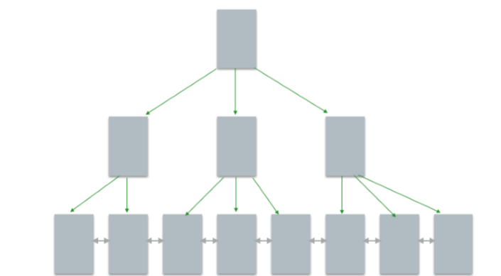
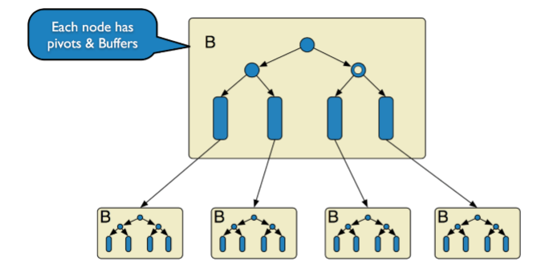

## InnoDB（B+树） 

### 原理

- InnoDB 底层存储结构为`B+树`， B树的每个节点对应innodb的一个`page`，page大小是固定的， 一般设为`16k`
- 非叶子节点只有键值，`叶子节点包含完整数据`

### 适用场景 
- 经常更新的表，适合处理多重并发的更新请求
- 聚簇索引
- 支持MVCC
- 支持行级锁
- 支持事务 
- 支持外键
- 对于AUTO_INCREMENT类型的字段，必须包含只有该字段的索引
- 不保存表的具体⾏数，扫描表来计算有多少⾏
- DELETE 表时，是一行⼀行地删除

## MyIASM

### 原理
- 是MySQL默认的引擎，但是它没有提供对数据库事务的支持，也不支持行级锁和外键， 因此当INSERT(插入)或UPDATE(更新)数据时即写操作需要锁定整个表，效率便会低一些
- ISAM 执行读取操作的速度很快，而且不占用大量的内存和存储资源。在设计之初就预想数据组织 成有固定长度的记录，按顺序存储的。---ISAM是一种静态索引结构。 

### 适用场景
- 执行`读取操作的速度很快`，而且不占用大量的内存和存储资源
- 非聚簇索引
- 不支持事务
- 不支持MVCC
- 不支持行级锁
- 不支持外键
- 保存表的具体行数，不带where时，直接返回保存的行数
- DELETE 表时，先drop表，然后重建表
- AUTO_INCREMENT类型字段可以和其他字段一起建立联合索引

## TokuDB（Fractal Tree-节点带数据） 

### 原理

- TokuDB 底层存储结构为Fractal Tree,Fractal Tree的结构与B+树有些类似, 在Fractal Tree 中，每一个child指针除了需要指向一个child节点外，还会带有一个Message Buffer ，这个 Message Buffer 是一个FIFO的队列，用来缓存更新操作。 
例如，一次插入操作只需要落在某节点的Message Buffer就可以马上返回了，并不需要搜索到叶 子节点。这些缓存的更新会在查询时或后台异步合并应用到对应的节点中。 

### 适用场景
- 主要适用于访问频率不高的数据或历史数据`归档`
- TokuDB在线添加索引，不影响读写操作, 非常快的写入性能， Fractal-tree在事务实现上有优势

## Memory 

### 原理

- Memory（也叫HEAP）堆内存：使用存在内存中的内容来创建表。每个MEMORY表只实际对应 一个磁盘文件。MEMORY 类型的表访问非常得快，因为它的数据是放在内存中的，并且默认使用 HASH索引。但是一旦服务关闭，表中的数据就会丢失掉。  Memory同时`支持散列索引和B树索 引`，B树索引可以使用部分查询和通配查询，也可以使用<,>和>=等操作符方便数据挖掘，散列索 引相等的比较快但是对于范围的比较慢很多

### 适用场景
- 快速`缓存`

## 一些常用命令
**查看MySQL提供的所有存储引擎**
```
mysql> show engines;
```
**查看MySQL当前默认的存储引擎**
```
mysql> show variables like '%storage_engine%';
```
**查看表的存储引擎**
```
mysql> show table status like "表名称" ;
```


