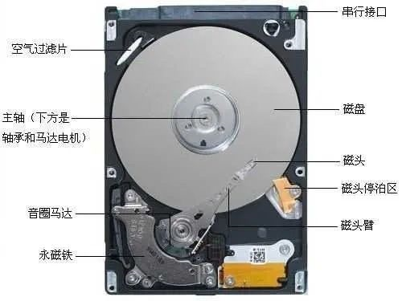
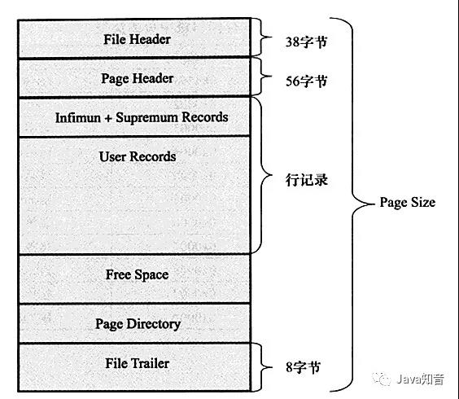
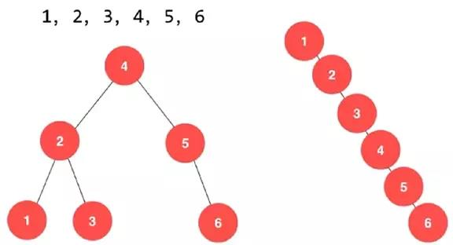
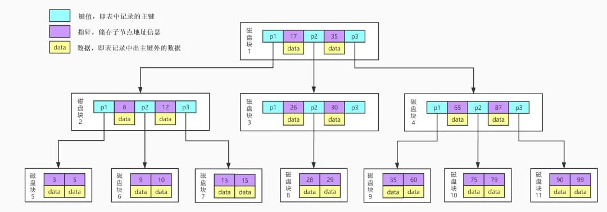
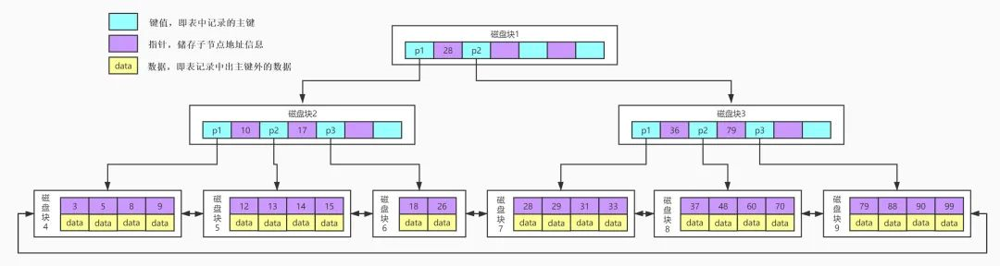
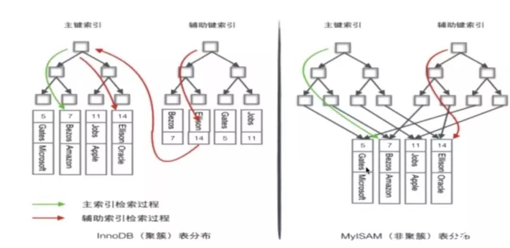
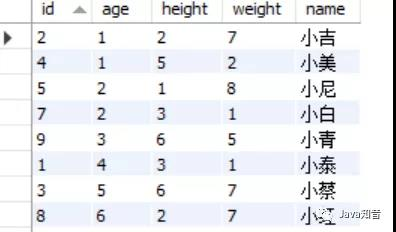
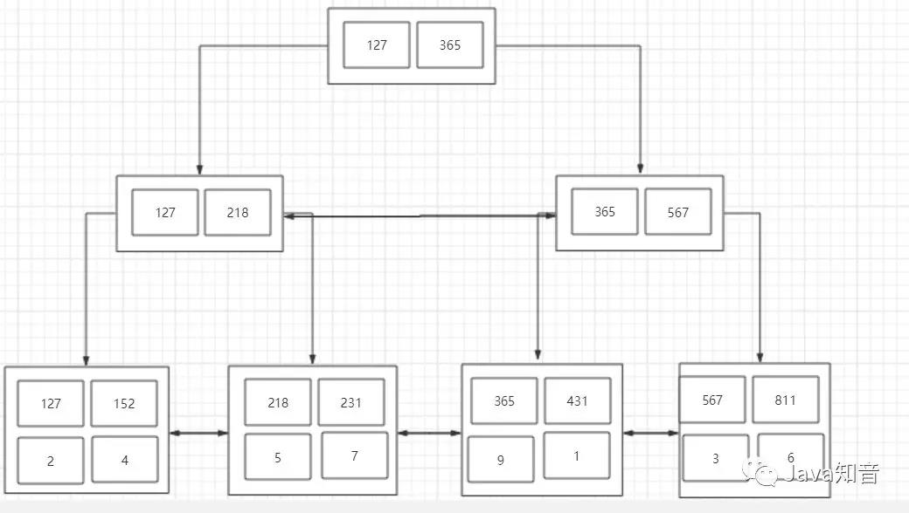

## 计算机的数据加载

### 磁盘IO和预读

- 磁盘读取数据靠的是机械运动，每一次读取数据需要`寻道、寻点、拷贝到内存`三步操作
	- 寻道时间是磁臂移动到指定磁道所需要的时间，一般在`5ms`以下
	- 寻点是从磁道中找到数据存在的那个点，`平均时间是半圈时间`，如果是一个7200转/min的磁盘，寻点时间平均是600000/7200/2=4.17ms；
	- 拷贝到内存的时间很快，和前面两个时间比起来可以`忽略不计`
- 所以一次IO的时间`平均是在9ms左右`，听起来很快，但数据库百万级别的数据过一遍就达到了9000s，显然就是灾难级别的了
- 考虑到磁盘IO是非常高昂的操作，计算机操作系统做了`预读的优化`，当一次IO时，不光把当前磁盘地址的数据，而是`把相邻的数据也都读取到内存缓冲区内`，因为当计算机访问一个地址的数据的时候，与其相邻的数据也会很快被访问到
- 每一次IO读取的数据我们称之为一页(page)，具体一页有多大数据跟操作系统有关，一般为4k或8k，也就是我们读取一页内的数据时候，实际上才发生了一次IO
- 那我们想要优化数据库查询，就要`尽量减少磁盘的IO操作`，所以就出现了索引

### 页
- 在操作系统的概念中，当我们往磁盘中取数据，假设要取出的数据的大小是1KB，但是操作系统并不会只取出这1kb的数据，而是会取出4KB的数据，因为操作系统的一个页表项的大小是4KB。那为什么我们只需要1KB的数据，但是操作系统要取出4KB的数据呢？
- “一个程序在访问了一条数据之后，在之后会有极大的可能再次访问这条数据和访问这条数据的相邻数据”，所以索性直接加载4KB的数据到内存中，下次要访问这一页的数据时，直接从内存中找，可以减少磁盘IO次数，我们知道，磁盘IO是影响程序性能主要的因素，因为磁盘IO和内存IO的速度是不可同日而语的
- 在MySQL的InnoDb引擎中，页的大小是`16KB`，是操作系统的4倍，而int类型的数据是4个字节，其它类型的数据的字节数通常也在4000字节以内，所以一页是可以存放很多很多条数据的，而MySQL的数据正是以页为基本单位组合而成的

#### InnoDB的页结构（叶子节点）

- File Header 字段用于记录 Page 的头信息，其中比较重要的是 FIL_PAGE_PREV 和 FIL_PAGE_NEXT 字段，通过这两个字段，我们可以找到该页的上一页和下一页，实际上所有页通过两个字段可以形成一条双向链表
- Page Header 字段用于记录 Page 的状态信息
- Infimum 和 Supremum 是两个伪行记录，Infimum（下确界）记录比该页中任何主键值都要小的值，Supremum （上确界）记录比该页中任何主键值都要大的值，这个伪记录分别构成了页中记录的边界
- User Records 中存放的是实际的数据行记录
- Free Space 中存放的是空闲空间，被删除的行记录会被记录成空闲空间
- Page Directory 记录着与二叉查找相关的信息
- File Trailer存储用于检测数据完整性的校验和等数据

## 索引的数据结构对比

### 二叉树

- 一般情况下，查找的时间复杂度为O(log n)
- 极端情况下，查找的时间复杂度为O(n)
- 没有使用场景

### B Tree

- 一棵m叉的BTree中每个节点`最多包含m个孩子`
- 除根节点与叶子节点外，每个节点`至少有[ceil(m/2)]个孩子`（ceil()为向上取整）
- 若根节点不是叶子节点，则`至少有2个孩子`
- 所有的叶子节点都在`同一层`
- 每个非叶子节点由n个key与n+1个指针组成，其中[ceil(m/2)-1] <= n <= m-1
- 可以让节点通过`合并、分裂、上移、下移`等操作，使得树高度较二叉查找树小，查找效率更高

### B+ Tree

- 非叶子节点上`只存储key值信息`，这样可以大大加大每个节点存储的key值数量，`降低B+Tree的高度`
- `所有数据记录节点`都是按照`键值大小顺序`存放在同一层的`叶子节点`上
- 在B+Tree上通常有两个头指针，一个指向根节点，另一个指向关键字最小的叶子节点，而且所有叶子节点（即数据节点）之间是一种`链式环结构`，所以我们除了可以对B+Tree进行主键的`范围查找`和`分页查找`，还可以从根节点开始，进行`随机查找`

### Hash
- 仅仅只能满足"="，"IN"，不能使用范围查询，由于其是由Hash运算获取的数据存放位置，每次Hash运算获取的是一个确定的值，且这个值并不与数据本身的大小有关系，所以其并不能满足范围查询
- 无法用来排序，Hash的索引值是由Hash运算获取的，其索引值与数据本身的大小并无明显关系
- 不能利用部分索引键查询
- 不能避免表扫描，由于Hash索引会产生Hash冲突，存在Hash冲突的数据会被连接到同一个链表上，当大量数据被连接到相同链表上时，查询某条数据就变成了扫描该链表，时间复杂度并不能保证在O(1)
- 遇到大量Hash值相等的情况后性能并不一定就会比B-Tree索引高

## 索引的类型

### 聚簇索引
- 将索引和数据放在一起
- InnoDB只有一个聚簇索引（主键索引）
- MyISAM没有聚簇索引

### 非聚簇索引
- 非聚簇索引就是将数据和索引分开，查找时需要先查找到索引，然后通过索引回表找到相应的数据
- MyISAM都是非聚簇索引
    - frm -- 表结构文件
    - MYI -- 索引文件
    - MYD -- 数据文件
- InnoDB除了聚簇索引（主键索引）以外，都是非聚簇索引
    - frm -- 表结构文件
    - idb -- 索引+数据文件

### 为什么InnoDB的非聚簇索引，叶子节点都是记录主键而不是地址
- 减少了出现行移动或者数据页分裂时非聚簇索引的维护工作（当数据需要更新的时候，非聚簇索引不需要修改，只需要修改聚簇索引，一个表只能有一个聚簇索引，其他的都是非聚簇索引，这样只需要修改聚簇索引就可以了，不需要重新构建非聚簇索引）
- 缺点--非聚簇索引体积可能会变大，因为二级索引中存储了主键的信息
- 缺点--非聚簇索引的访问可能需要两次索引查找。第一次通过查找 非聚簇索引 找到叶子节点存储的 主键的值；第二次通过这个主键的值去聚簇索引中查找对应的行

#### 什么情况下非聚簇索引可以不回表查询
- 覆盖索引（covering index），指一个查询语句的执行只用从索引中就能够取得，不必从数据表中读取，MySQL只需要通过索引就可以返回查询所需要的数据，这样避免了查到索引后再返回表操作，减少I/O提高效率

## 唯一索引与普通索引的区别

### 查询
- 普通索引查到符合条件的项后会继续查找下一项，如果下一项不符合再返回
- 唯一索引则是查到符合条件的项后就直接返回
- 其实这两种方式效率几乎没有差别，因为查找都是先读取数据项然后在内存中进行的所以多读取一次并不会带来很大的影响

### 更新
- change buffer是用来记录更新操作的一种行为，在没有把数据项从硬盘读取到内存中时，进行更新操作会先将操作记录的change buffer中
- 在下一次进行select的时候在把数据项读取到内存中时，会对数据项执行change buffer中的命令，这个过程也称为merge
- 普通索引往往是将操作记录到change buffer中，在下一次读取的时候执行这些操作，可以显著减少磁盘与内存的IO操作，从而提高效率
- 唯一索引首先判断要插入的项在数据库中存不存在，这里就涉及到了一个读的问题，往往这个时候就会把数据从硬盘读取到内存中，不会使用change buffer

### 结论
- 如果是读取远大于更新和插入的表，唯一索引和普通索引都可以
- 如果是更新和插入远大于读取的表，使用普通索引更好
- 如果是那种更新完要求立即可见的需求，就是刚更新完就要再查询的，这种情况下反而不推荐普通索引，因为这样会频繁的产生merge操作，起不到change buffer的作用，反而需要额外空间来维护change buffer就有点得不偿失了

## 联合索引

### 结构

- 定义（age,height,weight）为联合索引
- 非叶子节点为已排序的索引关键字组合
- 叶子节点为对应的主键

### 最左匹配原则
- MySQL会一直向右匹配直到遇到范围查询（>、<、between、like）就停止匹配
- =和in可以乱序，MySQL的查询优化器会优化成索引可以识别的形式

## 索引失效
- like以模糊匹配开头
- or
- 不符合最左匹配原则
- 数据类型出现隐式转化
- 在索引列上使用 IS NULL 或 IS NOT NULL操作
- 在索引字段上使用not，<>，!=，不等于操作符
- 对索引字段进行计算操作，字段上使用函数
- 当全表扫描速度比索引速度快时，mysql会使用全表扫描，此时索引失效

## 主键

### 主键的选取
- 使用显示定义的PRIMARY KEY作为主键
- 使用第一个不包含NULL值的唯一索引作为主键
- InnoDB内置6字节长的ROWID作为隐含主键（自增）

### 为什么要使用自增主键
- 数据记录存储于主索引（一颗B+Tree）的叶子节点上
- 这就要求同一个叶子节点内（大小为一个内存页或磁盘页）的各条数据记录按主键顺序存放，因此每当有一条新的记录插入时，MySQL会根据其主键将其插入适当的节点和位置，如果页面达到装载因子（InnoDB默认为15/16），则开辟一个新的页（节点）
- 如果表使用自增主键，那么每次插入新的记录，记录就会顺序添加到当前索引节点的后续位置，当一页写满，就会自动开辟一个新的页
- 如果使用非自增主键（如果身份证号或学号等），由于每次插入主键的值近似于随机，因此每次新记录都要被插到现有索引页的中间某个位置，此时MySQL不得不为了将新记录插到合适位置而移动数据，甚至目标页面可能已经被回写到磁盘上而从缓存中清掉，此时又要从磁盘上读回来，这增加了很多开销，同时频繁的移动、分页操作造成了大量的碎片，得到了不够紧凑的索引结构，后续不得不通过OPTIMIZE TABLE来重建表并优化填充页面

## 常见索引原则
- 选择唯一性索引
- 为经常需要排序、分组和联合操作的字段建立索引 
- 为常作为查询条件的字段建立 索引 
- 限制索引的数目
- 尽量使用数据量少的索引（如果索引的值很长，那么查询的速度会受到影响）
- 尽量使用前缀来索引
- 删除不再使用或者很少使用的索引
- 最左前缀匹配原则，非常重要的原则。
- 尽量选择区分度高的列作为索引
- 索引列不能参与计算
- 尽量的扩展索引，不要新建索引