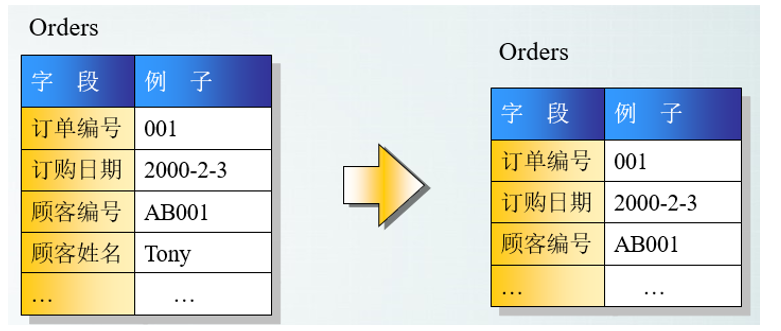

## 第一范式（1st NF －列都是不可再分）

- 第一范式的目标是确保`每列的原子性`:如果每列都是不可再分的最小数据单元（也称为最小的原子单元），则满足第一范式（1NF） 

## 第二范式（2nd NF－每个表只描述一件事情）

- 首先满足第一范式，并且表中非主键列不存在对主键的部分依赖
- 第二范式要求`每个表只描述一件事情` 

## 第三范式（3rd NF－ 不存在对非主键列的传递依赖）

- 第三范式定义是，满足第二范式，并且`表中的列不存在对非主键列的传递依赖`（除了主键订单编号外，顾客姓名依赖于非主键顾客编号）