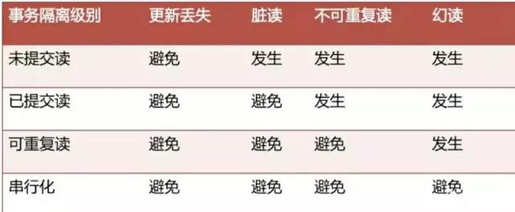
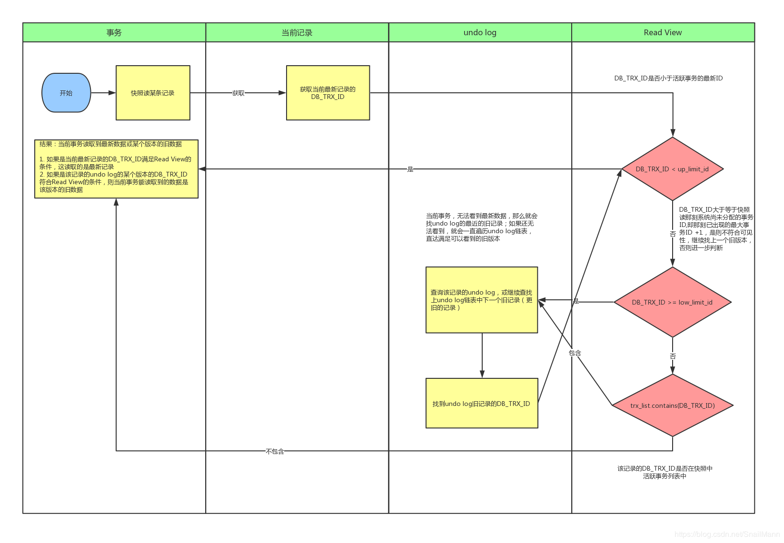

## 四大特性(ACID)

- **原子性（Atomicity）：** 原子性是指事务是一个不可分割的工作单位，事务中的操作要么都发生，要么都不发生
- **一致性（Consistency）：** 执行事务前后，数据保持一致，多个事务对同一个数据读取的结果是相同的
- **隔离性（Isolation）：** 多个事务，事务的隔离性是指多个用户并发访问数据库时，一个用户的事务不能被其它用户的事务所干扰，多个并发事务之间数据要相互隔离
- **持久性（Durability）：** 一个事务被提交之后。它对数据库中数据的改变是持久的，即使数据库发生故障也不应该对其有任何影响

### 并发事务问题
- **第一类修改丢失（回滚丢失）：** A事务回滚时，把已经提交的B事务的更新数据也一并回滚了
- **第二类修改丢失（覆盖丢失）：** A事务提交时把B事务已经提交的数据覆盖了，造成B事务所做操作丢失
- **脏读（Dirty read）:** 一个事务读到另一个事务未提交的数据
- **不可重复读（Unrepeatableread）:** 事务A多次读取同一条数据时，事务B修改该条数据并提交事务，导致事务A每次读取到的数据结果不一致（update影响）
- **幻读（Phantom read）:** 事务B对事务A的影响区间内进行增删操作，导致事务A读取到的数据一会多、一会少，就像产生幻觉了一样（insert/delete影响）

### 事务隔离级别

- **READ-UNCOMMITTED(读取未提交)：** 最低的隔离级别，允许读取尚未提交的数据变更，`可能会导致脏读、幻读或不可重复读`
- **READ-COMMITTED(读取已提交)：** oracle默认，允许读取并发事务已经提交的数据，`可以阻止脏读，但是幻读或不可重复读仍有可能发生`
- **REPEATABLE-READ(可重复读)：**  mysql默认，对同一字段的多次读取结果都是一致的，除非数据是被本身事务自己所修改，`可以阻止脏读和不可重复读，但幻读仍有可能发生（通过锁可以解决）`
- **SERIALIZABLE(可串行化)：** 最高的隔离级别，完全服从ACID的隔离级别，所有的事务依次逐个执行，这样事务之间就完全不可能产生干扰（select操作默认加上lock in share mode），`可以防止脏读、不可重复读以及幻读`

### 事务传播行为
- **PROPAGATION_REQUIRED（默认）**
    - 外部方法没有开启事务，则内部方法会创建自己的新事务，事务间相互独立，互不干扰
    - 外部方法开启事务，则所有内部方法都会加入到外部方法的事务中
- **PROPAGATION_REQUIRES_NEW**
	- 无论外部方法有无开启事务，内部方法都会创建自己的新事务，事务间相互独立，互不干扰
- **PROPAGATION_NESTED**
    - 外部方法没有开启事务，则内部方法会创建自己的新事务，事务间相互独立，互不干扰
    - 外部方法开启事务，则内部方法的事务都是外部方法的子事务，当外部方法事务回滚，则所有子事务都回滚，当单一子事务回滚，不会影响其他子事务
- **PROPAGATION_SUPPORTS**
	- 若外部方法有事务，则支持事务，若没有，则以非事务方式运行
- **PROPAGATION_NOT_SUPPORTED**
	- 若外部方法有事务，则挂起，待事务执行完成后，再运行该方法
- **PROPAGATION_MANDATORY**
	- 方法必须要有事务，否则抛错
- **PROPAGATION_NEVER**
	- 方法不能有事务，否则抛错

## 事务相关命令
```
SELECT * FROM information_schema.INNODB_TRX;	// 查询正在运行的事务
SELECT @@tx_isolation	// 查看隔离级别
```

## Undo Log

### 类型
- **insert undo log：** 代表事务在insert新记录时产生的undo log，只在事务回滚时需要，并且`在事务提交后可以被立即丢弃`
- **update undo log：** 事务在进行update或delete时产生的undo log，不仅在事务回滚时需要，在快照读时也需要，所以不能随便删除，`只有在快速读或事务回滚不涉及该日志时，对应的日志才会被purge线程统一清除`

### 作用
- MVCC
- 事务回滚

### 存储位置
- undo log实际上就是存在rollback segment中旧记录链

### purge线程
- 为了实现InnoDB的MVCC机制，更新或者删除操作都只是设置一下老记录的deleted_bit，并不真正将过时的记录删除
- purge线程自己也维护了一个read view（这个read view相当于系统中最老活跃事务的read view）
- 如果某个记录的deleted_bit为true，并且DB_TRX_ID相对于purge线程的read view可见，那么这条记录一定是可以被安全清除的

### 回滚
- 在回滚的时候，它实际上是做的相反的工作，比如一条INSERT ，对应一条 DELETE，对于每个UPDATE,对应一条相反的 UPDATE,将修改前的行放回去。undo日志用于事务的回滚操作进而保障了事务的原子性

## MVCC

### 简介
- MVCC(Mutil-Version Concurrency Control)，就是`多版本并发控制`，MVCC 是一种并发控制的方法，一般在数据库管理系统中，实现对数据库的并发访问
- 在Mysql的InnoDB引擎中就是指在`已提交读(READ COMMITTD)和可重复读(REPEATABLE READ)`这两种隔离级别下的事务`对于SELECT操作`会访问版本链中的记录的过程
- 这就使得别的事务可以修改这条记录，反正每次修改都会在版本链中记录，SELECT可以去版本链中拿记录，这就实现了读-写，写-读的并发执行，提升了系统的性能

### 原理

#### 当前读和快照读
- 像select lock in share mode(共享锁)，select for update，update，insert ，delete(排他锁)这些操作都是一种当前读，为什么叫当前读？就是它`读取的是记录的最新版本`，读取时还要保证其他并发事务不能修改当前记录，`会对读取的记录进行加锁`
- 像不加锁的select操作就是快照读，即`不加锁的非阻塞读`；快照读的前提是隔离级别不是串行级别，串行级别下的快照读会退化成当前读；之所以出现快照读的情况，是基于提高并发性能的考虑，快照读的实现是基于多版本并发控制，即MVCC，可以认为MVCC是行锁的一个变种，但它在很多情况下，避免了加锁操作，降低了开销；既然是基于多版本，即`快照读可能读到的并不一定是数据的最新版本，而有可能是之前的历史版本`

#### 隐式字段
- **DB_TRX_ID：** 最近修改(修改/插入)事务ID：记录创建这条记录/最后一次修改该记录的事务ID
- **DB_ROLL_PT：** 回滚指针，指向这条记录的上一个版本（undolog，存储于rollback segment里）
- **DB_ROW_ID：** 隐含的自增ID（隐藏主键），如果数据表没有主键，InnoDB会自动以DB_ROW_ID产生一个聚簇索引
- **DELETE BIT：** 索引删除标志,如果DB删除了一条数据,是优先通知索引将该标志位设置为1,然后通过(purge)清除线程去异步删除真实的数据

#### ReadView

##### 定义
- 在事务执行的那一刻，会生成数据库系统当前的一个`快照`，记录并维护系统`当前活跃事务的ID列表`

##### 组成
- **m_ids：** 表示在生成ReadView时当前系统中活跃的读写事务的事务id列表
- **min_trx_id：** 表示在生成ReadView时当前系统中活跃的读写事务中最小的事务id，也就是m_ids中的最小值
- **max_trx_id：** 表示生成ReadView时系统中应该分配给下一个事务的id值
- **creator_trx_id：** 表示生成该ReadView的事务的事务id

##### RC和RR级别下的InnoDB快照读有什么不同？
- **RC级别：**
	- 事务中，`每次快照读都会新生成一个快照和Read View`, 这就是我们在RC级别下的事务中可以看到别的事务提交的更新的原因
- **RR级别：**
    - 某个事务的对某条记录的`第一次快照读会创建一个快照及Read View`, 将当前系统活跃的其他事务记录起来，`此后在调用快照读的时候，还是使用的是同一个Read View`，所以只要当前事务在其他事务提交更新之前使用过快照读，那么之后的快照读使用的都是同一个Read View，所以对之后的修改不可见
    - 快照读生成Read View时，Read View会记录此时所有其他活动事务的快照，这些事务的修改对于当前事务都是不可见的，而早于Read View创建的事务所做的修改均是可见

#### 可见性算法
- DB_TRX_ID == creator_trx_id（`可见`），代表当前事务在`访问它自己修改过的记录`，所以该版本可以被当前事务访问
- DB_TRX_ID < min_trx_id（`可见`），代表DB_TRX_ID所在的记录`在Read View生成前出现的`，对当前事务可见
- DB_TRX_ID >= max_trx_id（`不可见`）， 代表DB_TRX_ID所在的记录`在Read View生成后才出现的`，对当前事务不可见
- min_trx_id <= DB_TRX_ID < max_trx_id，需要继续判断DB_TRX_ID是否在活跃事务之中
    - 如果在（`不可见`），代表Read View生成时刻，这个事务还在活跃，`还没有Commit`，所以该事务修改的数据，在当前事务是看不见的
    - 如果不在（`可见`），代表这个事务在Read View生成之前就`已经Commit`了，该事务修改的结果，在当前事务是能看见的

#### 流程

- 将要被修改的数据的最新记录中的DB_TRX_ID（即当前事务ID）取出来，与系统当前其他活跃事务的ID去对比（由Read View维护）
- 如果DB_TRX_ID跟Read View的属性做了某些比较，不符合`可见性算法`，那就通过DB_ROLL_PTR回滚指针去取出Undo Log中的DB_TRX_ID再比较，即遍历链表的DB_TRX_ID（从链首到链尾，即从最近的一次修改查起），直到找到满足特定条件的DB_TRX_ID
- 那么这个DB_TRX_ID所在的旧记录就是当前事务能看见的最新老版本


