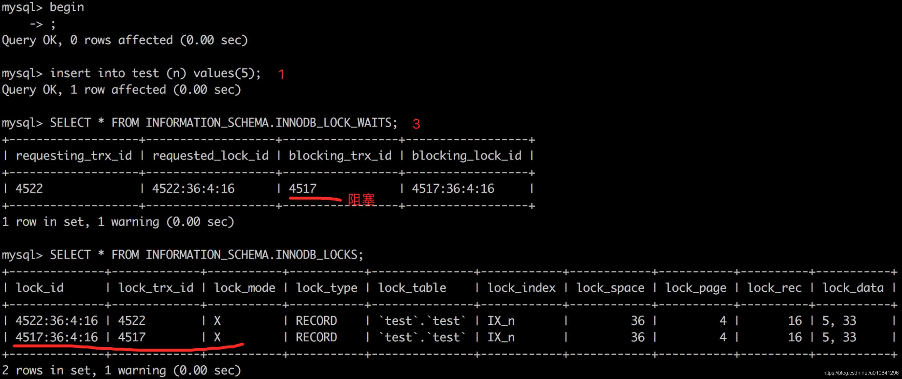
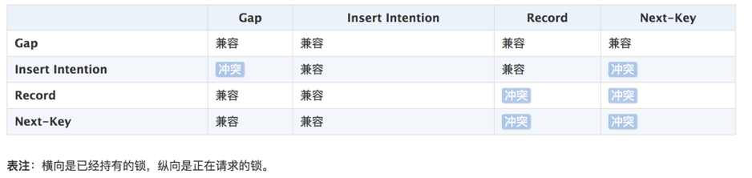

## 锁分类
### 共享锁Shared Locks（S锁）
- 兼容性：加了S锁的记录，允许其他事务再加S锁，不允许其他事务再加X锁
- 加锁方式：select…lock in share mode

### 排他锁Exclusive Locks（X锁）
- 兼容性：加了X锁的记录，不允许其他事务再加S锁或者X锁
- 加锁方式：select…for update

### 意向锁Intention Locks
- 意向锁是表锁，`其兼容性只与表锁有关，与行锁无关`
- 意向锁的存在是为了协调行锁和表锁的关系，支持`多粒度（表锁与行锁）的锁并存`
- 例子：事务A修改user表的记录r，会给记录r上一把行级的排他锁（X），同时会给user表上一把意向排他锁（IX），这时事务B要给user表上一个表级的排他锁就会被阻塞，意向锁通过这种方式实现了行锁和表锁共存且满足事务隔离性的要求
- 意向共享锁（IS锁）：事务在请求S锁前，要先获得IS锁
- 意向排他锁（IX锁）：事务在请求X锁前，要先获得IX锁

#### 为什么意向锁是表级锁呢？
- 当我们需要加一个表级别的锁时，需要根据意向锁去判断表中有没有数据行被锁定（行锁）
    - 如果意向锁是行锁，则需要遍历每一行数据去确认
    - 如果意向锁是表锁，则只需要判断一次即可知道有没数据行被锁定，`提升性能`

#### 意向锁怎么支持表锁和行锁并存
- 首先明确并存的概念是指数据库同时支持表、行锁，而不是任何情况都支持一个表中同时有一个事务A持有行锁、又有一个事务B持有表锁，因为表一旦被上了一个表级的写锁，肯定不能再上一个行级的锁
- 如果事务A对某一行上锁，其他事务就不可能修改这一行。这与“事务B锁住整个表就能修改表中的任意一行”形成了冲突。所以，没有意向锁的时候，让行锁与表锁共存，就会带来很多问题。于是有了意向锁的出现，如q1的答案中，数据库不需要在检查每一行数据是否有锁，而是直接判断一次意向锁是否存在即可，能提升很多性能

### 记录锁Record Locks
- 记录锁，仅仅锁住索引记录的一行，在单条索引记录上加锁
- record lock锁住的永远是索引，而非记录本身，即使该表上没有任何索引，那么innodb会在后台创建一个隐藏的聚集主键索引，那么锁住的就是这个隐藏的聚集主键索引
- 当一条sql没有走任何索引时，那么将会在每一条聚合索引后面加X锁，这个类似于表锁，但原理上和表锁应该是完全不同的

### 间隙锁Gap Locks
- 隔离级别为RR
- 作用：防止间隙内有新数据被插入， 防止已存在的数据，更新成间隙内的数据
- 区间锁, 仅仅锁住一个索引区间（`开区间`，不包括双端端点）
- 在索引记录之间的间隙中加锁，或者是在某一条索引记录之前或者之后加锁，并不包括该索引记录本身（比如在 1、2、3中，间隙锁的可能值有 (∞, 1)，(1, 2)，(2, ∞)）
- 间隙锁可用于`防止幻读`，保证索引间的不会被插入数据

### 临键锁Next-Key Locks
- record lock + gap lock，`左开右闭区间`
- 默认情况下，innodb使用next-key locks来锁定记录
- 当查询的索引`含有唯一属性`的时候，Next-Key Lock 会进行优化，将其`降级为Record Lock`，即仅锁住索引本身，不是范围
- Next-Key Lock在不同的场景中会退化：


### 插入意向锁Insert Intention Locks
- 插入意向锁是一种`Gap锁`，不是意向锁，`在insert操作时产生`
- 插入意向锁的作用是为了`提高并发插入的性能`， 多个事务 同时写入 不同数据 至同一索引范围（区间）内，并不需要等待其他事务完成，不会发生锁等待
    - 假设有一个记录索引包含键值4和7，不同的事务分别插入5和6，每个事务都会产生一个加在4-7之间的插入意向锁，获取在插入行上的排它锁，但是不会被互相锁住，因为数据行并不冲突
- 插入意向锁`不会阻止任何锁`，对于插入的记录会`持有一个记录锁`
    - 例如test表存在若干数据的数据，先开始一个事务A，插入一条n=5的数据；（图中步骤1）
    此时如果开始一个事务B，执行查询 select * from test where n > 4 for update，事务B会申请Gap锁（4, ∞)，申请成功后，被事务A的x锁阻塞，直到x锁被释放。（图中步骤2）
    可以看到图中步骤3的信息，在等待事务释放X锁
    

#### 间隙锁，记录锁，临键锁，插入意向锁的兼容性


### 自增锁AUTO-INC Locks
- AUTO-INC锁是一种特殊的表级锁，发生涉及AUTO_INCREMENT列的事务性插入操作时产生

## InnoDB加锁方法

### 隐式锁定
- 意向锁是 InnoDB 自动加的， 不需用户干预
- 对于 UPDATE、DELETE 和 INSERT 语句， InnoDB会自动给涉及数据集加排他锁（X）
- 对于普通 SELECT 语句，InnoDB 不会加任何锁
- InnoDB在事务执行过程中，使用`两阶段锁协议`：
    - 随时都可以执行锁定，InnoDB会根据隔离级别在需要的时候自动加锁
    - 锁只有在执行commit或者rollback的时候才会释放，并且所有的锁都是在同一时刻被释放

### 显式锁定 
- **select for update**
    - 在执行这个 select 查询语句的时候，会将对应的索引访问条目进行上排他锁（X 锁），也就是说这个语句对应的锁就相当于update带来的效果
    - select *** for update 的使用场景：为了让自己查到的数据确保是最新数据，并且查到后的数据只允许自己来修改的时候，需要用到 for update 子句
- **select lock in share mode**
    - in share mode 子句的作用就是将查找到的数据加上一个 share 锁，这个就是表示其他的事务只能对这些数据进行简单的select 操作，并不能够进行 DML 操作
    - select *** lock in share mode 使用场景：为了确保自己查到的数据没有被其他的事务正在修改，也就是说确保查到的数据是最新的数据，并且不允许其他人来修改数据。但是自己不一定能够修改数据，因为有可能其他的事务也对这些数据 使用了 in share mode 的方式上了 S 锁

## 死锁Deadlock Free
- **死锁产生：**
    - 死锁是指两个或多个事务在同一资源上相互占用，并请求锁定对方占用的资源，从而导致恶性循环
    - 当事务试图以不同的顺序锁定资源时，就可能产生死锁。多个事务同时锁定同一个资源时也可能会产生死锁
    - 锁的行为和顺序和存储引擎相关。以同样的顺序执行语句，有些存储引擎会产生死锁有些不会
    - 死锁有双重原因：真正的数据冲突；存储引擎的实现方式
- **检测死锁：**
    - 数据库系统实现了各种死锁检测和死锁超时的机制
    - InnoDB存储引擎能`检测到死锁的循环依赖`并立即返回一个错误
- **外部锁的死锁检测：**
    - 发生死锁后，InnoDB 一般都能自动检测到，并使一个事务释放锁并回退，另一个事务获得锁，继续完成事务
    - 但在涉及外部锁，或涉及表锁的情况下，InnoDB 并不能完全自动检测到死锁， 这需要通过设置锁等待超时参数 `innodb_lock_wait_timeout` 来解决
- **死锁恢复：**
    - 死锁发生以后，只有部分或完全回滚其中一个事务，才能打破死锁，InnoDB目前处理死锁的方法是，`将持有最少行级排他锁的事务进行回滚`，所以事务型应用程序在设计时必须考虑如何处理死锁，多数情况下只需要重新执行因死锁回滚的事务即可
- **死锁影响性能：** 
    - 死锁会影响性能而不是会产生严重错误，因为InnoDB会自动检测死锁状况并回滚其中一个受影响的事务
    - 在高并发系统上，当许多线程等待同一个锁时，死锁检测可能导致速度变慢。 有时当发生死锁时，禁用死锁检测（使用`innodb_deadlock_detect`配置选项）可能会更有效，这时可以依赖innodb_lock_wait_timeout设置进行事务回滚

## 查询命令
```
show engine innodb status;
show status like 'innodb_row_lock%';
show processlist;
select * from information_schema.INNODB_LOCKS;
select * from information_schema.INNODB_LOCK_WAITS;
```
