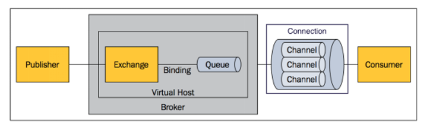

## 结构

### Message 
- 消息，消息是不具名的，它由消息头和消息体组成
- 消息体是不透明的，而消息头则由一系列的可选属性组成，这些属性包括 routing-key（路由键）、priority（相对于其他消息的优 先权）、delivery-mode（指出该消息可能需要持久性存储）等。

### Exchange（将消息路由给队列 ） 
- 交换器，用来接收生产者发送的消息并将这些消息路由给服务器中的队列

#### Exchange的类型
- **fanout交换器：** 它会把所有发送到该交换器的消息路由到`所有`与该交换器绑定的队列中
- **direct交换器：** direct类型的交换器路由规则很简单，它会把消息路由到哪些BindingKey和RoutingKey`完全匹配`的队列中
- **topic交换器：** 
    - 可以使来⾃不同源头的消息能够到达同⼀个队列
    - 使⽤topic交换器时，可以`使⽤通配符`，⽐如：“*” 匹配特定位 置的任意⽂本， “.” 把路由键分为了⼏部分，“#” 匹配所有规则等
    - 特别注意：发往topic交换器的消息不能随意的设置选择键（routing_key），`必须是由"."隔开的⼀系列的标识符组成`
- **headers交换器：** 根据发送消息内容的headers属性进⾏行匹配（由于`性能很差，不实用`）

### Binding（消息队列和交换器之间的关联） 
- 绑定，用于消息队列和交换器之间的关联
- 一个绑定就是基于路由键将交换器和消息队列连 接起来的路由规则，所以可以将交换器理解成一个由绑定构成的路由表

### Queue 
- 消息队列，用来保存消息直到发送给消费者
- 它是消息的容器，也是消息的终点
- 一个消息 可投入一个或多个队列
- 消息一直在队列里面，等待消费者连接到这个队列将其取走

#### RabbitMQ 上的⼀一个 queue 中存放的 message 是否有数量量限制
- 可以认为是⽆无限制，因为`限制取决于机器器的内存`，但是消息过多会导致处理理效率的下降

### Connection 
- 网络连接，比如一个TCP连接。 

### Channel 
- 信道，多路复用连接中的一条独立的双向数据流通道
- 信道是建立在真实的 TCP 连接内地虚 拟连接，AMQP 命令都是通过信道发出去的，不管是发布消息、订阅队列还是接收消息，这 些动作都是通过信道完成
- 因为对于操作系统来说建立和销毁 TCP 都是非常昂贵的开销，所 以引入了信道的概念，以复用一条 TCP 连接

### Consumer 
- 消息的消费者，表示一个从消息队列中取得消息的客户端应用程序

### Publisher 
- 消息的生产者，也是一个向交换器发布消息的客户端应用程序

### Virtual Host 
- 虚拟主机，表示一批交换器、消息队列和相关对象
- 虚拟主机是共享相同的身份认证和加密 环境的独立服务器域

### Broker 
- 表示消息队列服务器实体

2、rabbitmq设置过期时间，部分消息丢失： 采取批量量重导⽅方法：将丢失的那批数据查询导⼊入到mq⾥里里⾯面。

4、分布式部署： RabbitMQ⽆无法容忍不不同数据中⼼心之间⽹网络延迟，但是可以通过3种⽅方式实现分布式部署：Federation和Shovel。

5、如何确保消息正确地发送⾄至RabbitMQ？ RabbitMQ使⽤用发送⽅方确认模式，确保消息正确地发送到RabbitMQ。 发送⽅方确认模式：将信道设置成confirm模式（发送⽅方确认模式），则所有在信道上发布的消息都会被指派⼀一个唯⼀一的 ID。⼀一旦消息被投递到⽬目的队列列后，或者消息被写⼊入磁盘后（可持久化的消息），信道会发送⼀一个确认给⽣生产者（包含消息唯 ⼀一ID）。如果RabbitMQ发⽣生内部错误从⽽而导致消息丢失，会发送⼀一条nack（not acknowledged，未确认）消息。 发送⽅确认模式是异步的，⽣产者应⽤程序在等待确认的同时，可以继续发送消息。当确认消息到达⽣产者应⽤程序，⽣ 产者应⽤程序的回调⽅法就会被触发来处理确认消息。

6、如何确保消息接收⽅方消费了了消息？ 接收⽅方消息确认机制：消费者接收每⼀一条消息后都必须进⾏行行确认（消息接收和消息确认是两个不不同操作）。只有消费者确 认了了消息，RabbitMQ才能安全地把消息从队列列中删除。 这⾥里里并没有⽤用到超时机制，RabbitMQ仅通过Consumer的连接中断来确认是否需要重新发送消息。也就是说，只要连接不不 中断，RabbitMQ给了了Consumer⾜足够⻓长的时间来处理理消息。 特殊情况： 1、如果消费者接收到消息，在确认之前断开了连接或取消订阅，RabbitMQ会认为消息没有被分发，然后重新分发给下⼀ 个订阅的消费者。（可能存在消息重复消费的隐患，需要根据bizId去重） 2、如果消费者接收到消息却没有确认消息，连接也未断开，则RabbitMQ认为该消费者繁忙，将不会给该消费者分发更多 的消息。

7、如何避免消息重复投递或重复消费？ 在消息⽣生产时，MQ内部针对每条⽣生产者发送的消息⽣生成⼀一个inner-msg-id，作为去重和幂等的依据（消息投递失败并重 传），避免重复的消息进⼊入队列列；在消息消费时，要求消息体中必须要有⼀一个bizId（对于同⼀一业务全局唯⼀一，如⽀支付ID、订单 ID、帖⼦子ID等）作为去重和幂等的依据，避免同⼀一条消息被重复消费。

8、消息基于什什么传输？ 由于TCP连接的创建和销毁开销较⼤大，且并发数受系统资源限制，会造成性能瓶颈。RabbitMQ使⽤用信道的⽅方式来传输数
据。信道是建⽴立在真实的TCP连接内的虚拟连接，且每条TCP连接上的信道数量量没有限制。 1、RabbitMQ采⽤类似NIO（Non-blocking I/O）做法，选择TCP连接复⽤，不仅可以减少性能开销，同时也便于管理。 2、每个线程把持⼀个信道，所以信道服⽤了Connection的TCP连接。同时RabbitMQ可以确保每个线程的私密性，就像拥有 独⽴的连接⼀样。

9、消息如何分发？ 若该队列列⾄至少有⼀一个消费者订阅，消息将以循环（round-robin）的⽅方式发送给消费者。每条消息只会分发给⼀一个订阅的 消费者（前提是消费者能够正常处理理消息并进⾏行行确认）。

10、消息怎么路路由？ 从概念上来说，消息路路由必须有三部分：交换器器、路路由、绑定。⽣生产者把消息发布到交换器器上；绑定决定了了消息如何从交 换器器路路由到特定的队列列；消息最终到达队列列，并被消费者接收。 1、消息发布到交换器器时，消息将拥有⼀一个路路由键（routing key），在消息创建时设定。 2、通过队列列路路由键，可以把队列列绑定到交换器器上。 3、消息到达交换器器后，RabbitMQ会将消息的路路由键与队列列的路路由键进⾏行行匹配（针对不不同的交换器器有不不同的路路由规则）。 4、如果能够匹配到队列列，则消息会投递到相应队列列中；如果不不能匹配到任何队列列，消息将进⼊入 “⿊黑洞洞”。

11、如何确保消息不不丢失？ 消息持久化的前提是：将交换器器/队列列的durable属性设置为true，表示交换器器/队列列是持久交换器器/队列列，在服务器器崩溃或重 启之后不不需要重新创建交换器器/队列列（交换器器/队列列会⾃自动创建）。 如果消息想要从Rabbit崩溃中恢复，那么消息必须： 1、在消息发布前，通过把它的 “投递模式” 选项设置为2（持久）来把消息标记成持久化 2、将消息发送到持久交换器器 3、消息到达持久队列列         RabbitMQ确保持久性消息能从服务器重启中恢复的⽅式是，将它们写⼊磁盘上的⼀个持久化⽇志⽂件，当发布⼀条 持久性消息到持久交换器上时，Rabbit会在消息提交到⽇志⽂件后才发送响应（如果消息路由到了⾮持久队列，它会⾃动 从持久化⽇志中移除）。⼀旦消费者从持久队列中消费了⼀条持久化消息，RabbitMQ会在持久化⽇志中把这条消息标记为 等待垃圾收集。如果持久化消息在被消费之前RabbitMQ重启，那么Rabbit会⾃动重建交换器和队列（以及绑定），并重播 持久化⽇志⽂件中的消息到合适的队列或者交换器上。

12、使⽤用RabbitMQ有什什么好处？ 1. 应⽤用解耦（系统拆分） 2. 异步处理理（预约挂号业务处理理成功后，异步发送短信、推送消息、⽇日志记录等，可以⼤大⼤大减⼩小响应时间） 3. 消息分发 4. 流量量削峰：将请求发送到队列列中，短暂的⾼高峰期积压是允许的。 5. 消息缓冲 ...

13、消息队列列有什什么缺点？ 1. 系统可⽤用性降低：消息队列列出问题影响业务； 2. 系统复杂性增加：加⼊入消息队列列，需要考虑很多⽅方⾯面的问题，⽐比如：⼀一致性问题、如何保证消息不不被重复消费、如何保 证消息可靠性传输等。 

14、MQ如何选型？
1. 中⼩小型公司⾸首选RabbitMQ：管理理界⾯面简单，⾼高并发。 2. ⼤大型公司可以选择RocketMQ：更更⾼高并发，可对rocketmq进⾏行行定制化开发。 3. ⽇日志采集功能，⾸首选kafka，专为⼤大数据准备。

15、如何保证消息队列列⾼高可⽤用？ 1. 集群：
集群可以扩展消息通信的吞吐量量，但是不不会备份消息，备份消息要通过镜像队列列的⽅方式解决。 队列列存储在单个节点、交换器器存储在所有节点。 2. 镜像队列列：将需要消费的队列列变为镜像队列列，存在于多个节点，这样就可以实现RabbitMQ的HA⾼高可⽤用性。作⽤用就是消 息实体会主动在镜像节点之间实现同步，⽽而不不是像普通模式那样，在consumer消费数据时临时读取。缺点就是，集群内部的 同步通讯会占⽤用⼤大量量的⽹网络带宽。
特性 ActiveMQ RabbitMQ RocketMQ kafka
开发语⾔言 java erlang java scala
单机吞吐量量 万级 万级 10万级 10万级
时效性 ms级 us级 ms级 ms级以内
可⽤用性 ⾼高(主从架构) ⾼高(主从架构) ⾮非常⾼高(分布式架构) ⾮非常⾼高(分布式架构)
功能特性
成熟的产品，在很多公司 得到应⽤用；有较多的⽂文 档；各种协议⽀支持较好
基于erlang开发，所以并 发能⼒力力很强，性能极其 好，延时很低;管理理界⾯面较 丰富
MQ功能⽐比较完备，扩展 性佳
只⽀支持主要的MQ功能， 像⼀一些消息查询，消息回 溯等功能没有提供，毕竟 是为⼤大数据准备的，在⼤大 数据领域应⽤用⼴广。

 16、如何保证消息的顺序性？ 1. 通过某种算法，将需要保持先后顺序的消息放到同⼀一个消息队列列中(kafka中就是partition,rabbitMq中就是 queue)。然后只⽤用⼀一个消费者去消费该队列列。 2. 可以在消息体内添加全局有序标识来实现。

17、使⽤用RabbitMQ增加rest服务吞吐量量。

18、RabbitMQ交换器器有哪些类型？ 1. fanout交换器器：它会把所有发送到该交换器器的消息路路由到所有与该交换器器绑定的队列列中； 2. direct交换器器：direct类型的交换器器路路由规则很简单，它会把消息路路由到哪些BindingKey和RoutingKey完全匹配的队列列 中； 3. topic交换器器：匹配规则⽐比direct更更灵活。 4. headers交换器器：根据发送消息内容的headers属性进⾏行行匹配（由于性能很差，不不实⽤用）。 常⽤的交换器主要分为以下三种： 1、direct：如果路由键完全匹配，消息就被投递到相应的队列 2、fanout：如果交换器收到消息，将会⼴播到所有绑定的队列上 3、topic：可以使来⾃不同源头的消息能够到达同⼀个队列。 使⽤topic交换器时，可以使⽤通配符，⽐如：“*” 匹配特定位 置的任意⽂本， “.” 把路由键分为了⼏部分，“#” 匹配所有规则等。特别注意：发往topic交换器的消息不能随意的设置选择 键（routing_key），必须是由"."隔开的⼀系列的标识符组成。

19、RabbitMQ如何保证数据⼀一致性？ 1. ⽣生产者确认机制：消息持久化后异步回调通知⽣生产者，保证消息已经发出去； 2. 消息持久化：设置消息持久化； 3. 消费者确认机制：消费者成功消费消息之后，⼿手动确认，保证消息已经消费。

20、RabbitMQ消费者⾃自动扩展数量量 SimpleMessageListenerContainer可根据RabbitMQ消息堆积情况⾃自动扩展消费者数量量。

 22、rabbitmq队列列与消费者的关系？ 1. ⼀一个队列列可以绑定多个消费者； 2. 消息默认以循环的⽅方式发送给消费者； 3. 消费者收到消息默认⾃自动确认，也可以改成⼿手动确认。