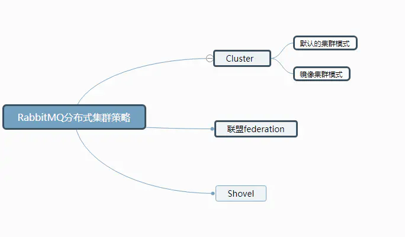
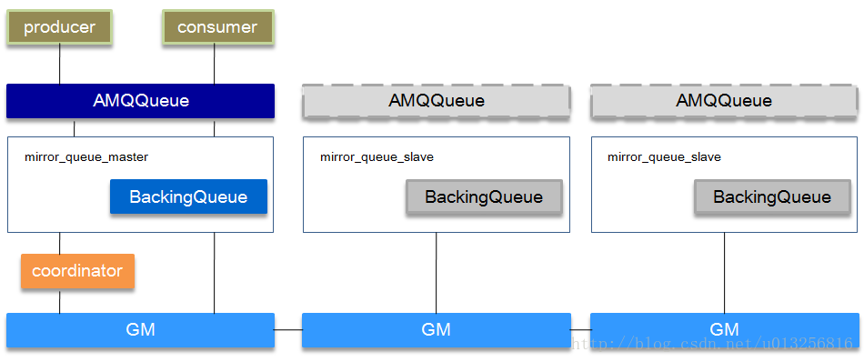

## 结构

### Message 
- 消息，消息是不具名的，它由消息头和消息体组成
- 消息体是不透明的，而消息头则由一系列的可选属性组成，这些属性包括 routing-key（路由键）、priority（相对于其他消息的优 先权）、delivery-mode（指出该消息可能需要持久性存储）等。

### Exchange 
- 交换器，用来接收生产者发送的消息并将这些消息路由给服务器中的队列

#### Exchange的类型
- **fanout交换器：** 它会把所有发送到该交换器的消息路由到`所有`与该交换器绑定的队列中
- **direct交换器：** direct类型的交换器路由规则很简单，它会把消息路由到哪些BindingKey和RoutingKey`完全匹配`的队列中
- **topic交换器：** 
    - 可以使来⾃不同源头的消息能够到达同⼀个队列
    - 使⽤topic交换器时，可以`使⽤通配符`，⽐如：“*” 匹配特定位 置的任意⽂本， “.” 把路由键分为了⼏部分，“#” 匹配所有规则等
    - 特别注意：发往topic交换器的消息不能随意的设置选择键（routing_key），`必须是由"."隔开的⼀系列的标识符组成`
- **headers交换器：** 根据发送消息内容的headers属性进⾏行匹配（由于`性能很差，不实用`）

#### 消息怎么路由
- 从概念上来说，消息路由必须有三部分：交换器、路由、绑定
- 生产者把消息发布到交换器上
- 绑定决定了消息如何从交换器路由到特定的队列
- 消息最终到达队列，并被消费者接收
- 1、消息发布到交换器时，消息将拥有一个路由键（routing key），在消息创建时设定
- 2、通过队列路由键，可以把队列绑定到交换器上
- 3、消息到达交换器后，RabbitMQ会将消息的路由键与队列的路由键进行匹配（针对不同的交换器有不同的路由规则）
- 4、如果能够匹配到队列，则消息会投递到相应队列中；如果不能匹配到任何队列，消息将进入 “黑洞”

### Binding
- 绑定，用于消息队列和交换器之间的关联
- 一个绑定就是基于路由键将交换器和消息队列连 接起来的路由规则，所以可以将交换器理解成一个由绑定构成的路由表

### Queue 
- 消息队列，用来保存消息直到发送给消费者
- 它是消息的容器，也是消息的终点
- 一个消息 可投入一个或多个队列
- 消息一直在队列里面，等待消费者连接到这个队列将其取走

#### 消息如何分发
- 若该队列列⾄至少有一个消费者订阅，消息将以`循环`（round-robin）的⽅方式发送给消费者
- 每条消息只会分发给一个订阅的消费者（前提是消费者能够正常处理消息并进行确认）

#### RabbitMQ 上的一个 queue 中存放的 message 是否有数量限制
- 可以认为是无限制，因为`限制取决于机器的内存`，但是消息过多会导致处理效率的下降

### Connection 
- 网络连接，比如一个TCP连接。 

### Channel 
- 信道，多路复用连接中的一条独立的双向数据流通道
- 信道是建立在真实的 TCP连接内的虚拟连接，AMQP 命令都是通过信道发出去的，不管是发布消息、订阅队列还是接收消息，这些动作都是通过信道完成
- 因为对于操作系统来说建立和销毁 TCP 都是非常昂贵的开销，所以引入了信道的概念， 每个线程把持⼀个信道，所以信道复⽤了Connection的TCP连接

### Consumer 
- 消息的消费者，表示一个从消息队列中取得消息的客户端应用程序

### Publisher 
- 消息的生产者，也是一个向交换器发布消息的客户端应用程序

### Virtual Host 
- 虚拟主机，表示一批交换器、消息队列和相关对象
- 虚拟主机是共享相同的身份认证和加密 环境的独立服务器域

### Broker 
- 表示消息队列服务器实体

## 集群

### Cluster集群

#### RabbitMQ集群元数据的同步
- RabbitMQ集群会始终同步四种类型的内部元数据
    - 队列元数据：队列名称和它的属性
    - 交换器元数据：交换器名称、类型和属性
    - 绑定元数据：一张简单的表格展示了如何将消息路由到队列
    - vhost元数据：为vhost内的队列、交换器和绑定提供命名空间和安全属性
- 因此，当用户访问其中任何一个RabbitMQ节点时，通过rabbitmqctl查询到的queue／user／exchange/vhost等信息都是相同的

#### 集群节点类型
- **磁盘节点** 将配置信息和元信息存储在磁盘上
- **内存节点** 将配置信息和元信息存储在内存中，`性能是优于磁盘节点的`
- 两者都会将设置为持久化的队列消息存放到磁盘

#### 普通集群

- `元数据信息在所有节点上是一致的`，而Queue（存放消息的队列）的`完整数据则只会存在于它所创建的那个节点上`，其他节点只知道这个queue的metadata信息和一个指向queue的owner node的指针
- **客户端直接连接队列所在节点** 如果有一个消息生产者或者消息消费者通过amqp-client的客户端连接至节点1进行消息的发布或者订阅，那么此时的集群中的消息收发只与节点1相关
- **客户端连接的是非队列数据所在节点** 
	- 如果消息生产者所连接的是节点2或者节点3，此时队列1的完整数据不在该两个节点上，那么在发送消息过程中这两个节点主要起了一个`路由转发`作用，根据这两个节点上的元数据转发至节点1上，`最终发送的消息还是会存储至节点1的队列1上`
	- 同样，如果消息消费者所连接的节点2或者节点3，那这两个节点也会作为路由节点起到`转发`作用，将会从节点1的队列1中拉取消息进行消费

#### 镜像队列

- 镜像节点在集群中的其他节点拥有`从队列拷贝`，一旦主节点不可用，最老的从队列将被选举为新的主队列
- 镜像队列`不能作为负载均衡使用`，因为每个操作在所有节点都要做一遍，该模式带来的副作用也很明显，除了`降低系统性能`外，如果镜像队列数量过多，加之大量的消息进入，集群内部的网络带宽将会被这种同步通讯大大消耗掉，实现`高可用`

### 联盟（federation）集群
- 联盟模式允许单台服务器上的交换机或队列接收到另一台服务器上交换机或队列的消息，可以是单独机器或集群
- 服务器节点之间通过AMQP协议通信，节点不必有相同的Erlang Cookie。
- 服务器节点之间可运行不同版本RabbitMQ和Erlang
- 可以应用于广域网。
- 通常使用*联盟模式连接internet上的中间服务器，用作订阅分发消息或工作队列。

### Shovel
- shovel连接方式与联盟（federation）的连接方式类似，但它工作在更低层次。shovel接受队列上的消息，转发到另一台服务器上的交换机。
- shovel和联盟类似，但它比联盟提供更多控制。

## 如何确保消息不丢失

### 消息持久化
- 实例要使用`磁盘节点`
- 将交换器/队列的`durable属性设置为true`，表示交换器/队列是持久交换器/队列，在服务器崩溃或重启之后不需要重新创建交换器/队列（交换器/队列会自动创建）
- 如果消息想要从Rabbit崩溃中恢复，那么消息必须： 
    - 在消息发布前，通过把它的`Delivery mode`选项设置为`2-Persistent`来把消息标记成持久化 
    - 将消息发送到持久交换器器
    - 消息到达持久队列
- RabbitMQ确保持久性消息能从服务器重启中恢复的⽅式是
- 将它们写⼊磁盘上的⼀个持久化⽇志⽂件，当发布⼀条持久性消息到持久交换器上时，Rabbit会`在消息提交到⽇志⽂件后才发送响应`（如果消息路由到了⾮持久队列，它会⾃动从持久化⽇志中移除）
- ⼀旦消费者从持久队列中消费了⼀条持久化消息，RabbitMQ会在持久化⽇志中把这条消息标记为`等待垃圾收集`
- 如果持久化消息在被消费之前RabbitMQ重启，那么Rabbit会⾃动重建交换器和队列（以及绑定），并`重播持久化⽇志⽂件`中的消息到合适的队列或者交换器上

### 如何确保消息正确地发送⾄至RabbitMQ
- 发送消息前，将消息记录到数据库，并标记为`待发送`
- 消息是否成功发送到Exchange
	- 开启confirm回调`spring.rabbitmq.publisher-confirms=true`
	- 当消息成功到达Exchange后，会有`异步的成功回调`
	- 修改数据库中的消息状态为`发送成功`
- 消息是否成功发送到Queue
    - 设置mandatory=true（当Exchange没有找到Queue时，是否直接丢弃，不触发回调）
    - 开启return回调`spring.rabbitmq.publisher-returns=true`
    - 是一个`异步的失败回调`
    - 修改数据库中的消息状态为`待发送`
- 开启定时任务，重发数据库中状态不是`发送成功`的消息

### 如何确保消息接收方消费了消息
- 接收方消息确认机制：消费者接收每一条消息后都必须进行确认（消息接收和消息确认是两个不不同操作）
- 只有消费者确认了消息，RabbitMQ才能安全地把消息从队列中删除
- 这里并没有用到超时机制，RabbitMQ仅通过Consumer的连接中断来确认是否需要重新发送消息。也就是说，只要连接不中断，RabbitMQ给了Consumer足够长的时间来处理消息
- 特殊情况：
    - 如果消费者接收到消息，在确认之前断开了连接或取消订阅，RabbitMQ会认为消息没有被分发，然后重新分发给下⼀个订阅的消费者（可能存在消息重复消费的隐患，需要根据bizId去重）
    - 如果消费者接收到消息却没有确认消息，连接也未断开，则RabbitMQ认为该消费者繁忙，将不会给该消费者分发更多的消息
- 实现方式：使用手动确认`spring.rabbitmq.listener.simple.acknowledge-mode=manual`

## 如何避免消息重复投递或重复消费
- 在消息生产时，MQ内部针对每条生产者发送的消息生成一个inner-msg-id，作为去重和幂等的依据（消息投递失败并重传），避免重复的消息进入队列
- 在消息消费时，要求消息体中必须要有一个bizId（对于同一业务全局唯一，如支付ID、订单ID、帖子ID等）作为去重和幂等的依据，避免同一条消息被重复消费

