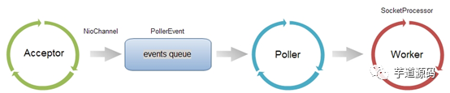

## NiO、BiO、APR

### Connector的protocol
- Connector在处理HTTP请求时，会使用不同的protocol。不同的Tomcat版本支持的protocol不同，其中最典型的protocol包括BIO、NIO和APR（Tomcat7中支持这3种，Tomcat8增加了对NIO2的支持，而到了Tomcat8.5和Tomcat9.0，则去掉了对BIO的支持）
- BIO是Blocking IO，顾名思义是阻塞的IO
- NIO是Non-blocking IO，则是非阻塞的IO
- APR是Apache Portable Runtime，是Apache可移植运行库，利用本地库可以实现高可扩展性、高性能；Apr是在Tomcat上运行高并发应用的首选模式，但是需要安装apr、apr-utils、tomcat-native等包

### 如何指定protocol

- Connector使用哪种protocol，可以通过元素中的protocol属性进行指定，也可以使用默认值
- 指定的protocol取值及对应的协议如下：
```
HTTP/1.1：默认值，使用的协议与Tomcat版本有关
org.apache.coyote.http11.Http11Protocol：BIO
org.apache.coyote.http11.Http11NioProtocol：NIO
org.apache.coyote.http11.Http11Nio2Protocol：NIO2
org.apache.coyote.http11.Http11AprProtocol：APR
```
- 如果没有指定protocol，则使用默认值HTTP/1.1，其含义如下：在Tomcat7中，自动选取使用BIO或APR（如果找到APR需要的本地库，则使用APR，否则使用BIO）；在Tomcat8中，自动选取使用NIO或APR（如果找到APR需要的本地库，则使用APR，否则使用NIO）

### BIO/NIO有何不同
- 无论是BIO，还是NIO，Connector处理请求的大致流程是一样的
- 在accept 队列中接收连接（当客户端向服务器发送请求时，如果客户端与OS 完成三次握手建立了连接，则OS 将该连接放入accept 队列）；在连接中获取请求的数据，生成request ；调用servlet 容器处理请求；返回response 。 为了便于后面的说明，首先明确一下连接与请求的关系：连接是TCP层面的（传输层），对应socket；请求是HTTP层面的（应用层），必须依赖于TCP的连接实现；一个TCP连接中可能传输多个HTTP请求。
在BIO实现的Connector中，处理请求的主要实体是JIoEndpoint对象。JIoEndpoint维护了Acceptor和Worker：Acceptor接收socket，然后从Worker线程池中找出空闲的线程处理socket，如果worker线程池没有空闲线程，则Acceptor将阻塞。其中Worker是Tomcat自带的线程池，如果通过配置了其他线程池，原理与Worker类似。
在NIO实现的Connector中，处理请求的主要实体是NIoEndpoint对象。NIoEndpoint中除了包含Acceptor和Worker外，还使用了Poller，处理流程如下图所示

Acceptor接收socket后，不是直接使用Worker中的线程处理请求，而是先将请求发送给了Poller，而Poller是实现NIO的关键。Acceptor向Poller发送请求通过队列实现，使用了典型的生产者-消费者模式。在Poller中，维护了一个Selector对象；当Poller从队列中取出socket后，注册到该Selector中；然后通过遍历Selector，找出其中可读的socket，并使用Worker中的线程处理相应请求。与BIO类似，Worker也可以被自定义的线程池代替。
通过上述过程可以看出，在NIoEndpoint处理请求的过程中，无论是Acceptor接收socket，还是线程处理请求，使用的仍然是阻塞方式；但在“读取socket并交给Worker中的线程”的这个过程中，使用非阻塞的NIO实现，这是NIO模式与BIO模式的最主要区别（其他区别对性能影响较小，暂时略去不提）。而这个区别，在并发量较大的情形下可以带来Tomcat效率的显著提升：
目前大多数HTTP请求使用的是长连接（HTTP/1.1默认keep-alive为true），而长连接意味着，一个TCP的socket在当前请求结束后，如果没有新的请求到来，socket不会立马释放，而是等timeout后再释放。如果使用BIO，“读取socket并交给Worker中的线程”这个过程是阻塞的，也就意味着在socket等待下一个请求或等待释放的过程中，处理这个socket的工作线程会一直被占用，无法释放；因此Tomcat可以同时处理的socket数目不能超过最大线程数，性能受到了极大限制。而使用NIO，“读取socket并交给Worker中的线程”这个过程是非阻塞的，当socket在等待下一个请求或等待释放时，并不会占用工作线程，因此Tomcat可以同时处理的socket数目远大于最大线程数，并发性能大大提高。

## acceptCount、maxConnections、maxThreads
- **acceptCount：**
    - accept队列的长度
    - 当accept队列中连接的个数达到acceptCount时，队列满，进来的请求一律被拒绝，默认值是100
- **maxConnections：**
    - Tomcat在任意时刻接收和处理的最大连接数
    - 当Tomcat接收的连接数达到maxConnections时，Acceptor线程不会读取accept队列中的连接；这时accept队列中的线程会一直阻塞着，直到Tomcat接收的连接数小于maxConnections，如果设置为-1，则连接数不受限制
    - 默认值与连接器使用的协议有关：NIO的默认值是10000，APR/native的默认值是8192，而BIO的默认值为maxThreads（如果配置了Executor，则默认值是Executor的maxThreads）
- **maxThreads：**
    - 请求处理线程的最大数量
    - 默认值是200（Tomcat7和8都是的）
    - 如果该Connector绑定了Executor，这个值会被忽略，因为该Connector将使用绑定的Executor，而不是内置的线程池来执行任务
    - maxThreads规定的是最大的线程数目，并不是实际running的CPU数量；实际上，maxThreads的大小比CPU核心数量要大得多。这是因为，处理请求的线程真正用于计算的时间可能很少，大多数时间可能在阻塞，如等待数据库返回数据、等待硬盘读写数据等。因此，在某一时刻，只有少数的线程真正的在使用物理CPU，大多数线程都在等待；因此线程数远大于物理核心数才是合理的
    - 换句话说，Tomcat通过使用比CPU核心数量多得多的线程数，可以使CPU忙碌起来，大大提高CPU的利用率

### 设置建议
- maxThreads的设置既与应用的特点有关，也与服务器的CPU核心数量有关。通过前面介绍可以知道，maxThreads数量应该远大于CPU核心数量；而且CPU核心数越大，maxThreads应该越大；应用中CPU越不密集（IO越密集），maxThreads应该越大，以便能够充分利用CPU。当然，maxThreads的值并不是越大越好，如果maxThreads过大，那么CPU会花费大量的时间用于线程的切换，整体效率会降低
- maxConnections的设置与Tomcat的运行模式有关。如果tomcat使用的是BIO，那么maxConnections的值应该与maxThreads一致；如果tomcat使用的是NIO，maxConnections值应该远大于maxThreads。
- 通过前面的介绍可以知道，虽然tomcat同时可以处理的连接数目是maxConnections，但服务器中可以同时接收的连接数为maxConnections+acceptCount 。acceptCount的设置，与应用在连接过高情况下希望做出什么反应有关系。如果设置过大，后面进入的请求等待时间会很长；如果设置过小，后面进入的请求立马返回connection refused。
```
server.tomcat.accept-count=1000
server.tomcat.max-threads=800
server.tomcat.min-spare-threads=100
server.tomcat.max-connections=10000（默认）
```

### 这两个值如何起作用，请看下面三种情况
- 情况1：接受一个请求，此时tomcat起动的线程数没有到达maxThreads，tomcat会起动一个线程来处理此请求。
- 情况2：接受一个请求，此时tomcat起动的线程数已经到达maxThreads，tomcat会把此请求放入等待队列，等待空闲线程。
- 情况3：接受一个请求，此时tomcat起动的线程数已经到达maxThreads，等待队列中的请求个数也达到了acceptCount，此时tomcat会直接拒绝此次请求，返回connection refused

### 发现并发容量问题
- 使用`pstree -p pid | wc -l`命令可以查看Java进程一共维护了多少个线程，在没有压测的时候，Tomcat维护了31个线程（不同机器该值不一定）。而进行压测的时候，Tomcat维护的线程数量猛增至200多个。
- 使用`top -H`命令可以查看CPU的使用情况，主要关注us，用户进程占用的CPU；sy，内核进程占用的CPU。还有load average，这个很重要，反映了CPU的负载强度。
- 在当前线程数量的情况下，发送100个线程，CPU的压力不算太大，所有请求都得到了处理；而发送5000个线程，大量请求报错，默认的线程数量不够用了，可见可以提高Tomcat维护的线程数

### 网络连接优化
当然Spring Boot并没有把内嵌Tomcat的所有配置都导出。一些配置需要通过 WebServerFactoryCustomizer<ConfigurableWebServerFactory>接口来实现自定义。

这里需要自定义KeepAlive长连接的配置，减少客户端和服务器的连接请求次数，避免重复建立连接，提高性能。
```
@Component
public class WebServerConfiguration implements WebServerFactoryCustomizer<ConfigurableWebServerFactory> {
    @Override
    public void customize(ConfigurableWebServerFactory factory) {
        //使用对应工厂类提供给我们的接口，定制化Tomcat connector
        ((TomcatServletWebServerFactory) factory).addConnectorCustomizers(new TomcatConnectorCustomizer() {
            @Override
            public void customize(Connector connector) {
                Http11NioProtocol protocol = (Http11NioProtocol) connector.getProtocolHandler();
                //定制化KeepAlive Timeout为30秒
                protocol.setKeepAliveTimeout(30000);
                //10000个请求则自动断开
                protocol.setMaxKeepAliveRequests(10000);
            }
        });
    }
}
```